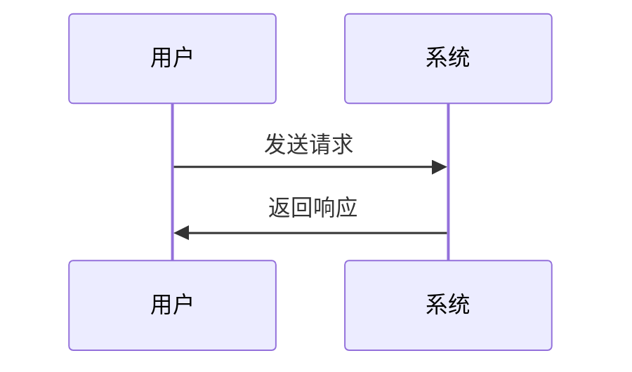

# Mermaid图表输出规则

## 输出格式要求
 
非必要，不需要输出流程图、序列图、架构图等图表
不是每次对话，都需要输出图标

当需要输出流程图、序列图、架构图等图表时，请遵循以下规则：

### 1. 双重输出格式
- **聊天栏显示**：输出渲染后的真实图表，便于直观查看
- **代码块输出**：代码块会被添加到demo_cluster/demo_mermaid.md文件中

### 2. Mermaid代码块格式
使用标准的Mermaid代码块格式：

```
```mermaid
图表类型
    图表内容
```
```

### 3. 支持的图表类型
- `sequenceDiagram` - 序列图
- `flowchart TD/LR` - 流程图
- `graph TB/LR` - 关系图  
- `stateDiagram-v2` - 状态图
- `classDiagram` - 类图
- `gitgraph` - Git图
- `pie` - 饼图
- `journey` - 用户旅程图

### 4. 命名规范
- 使用中文描述，便于理解
- 节点名称简洁明了
- 关系描述清晰准确

### 5. 文件管理
- 所有Mermaid代码块会被添加到 `demo_cluster/demo_Mermaid.md` 文件中
- 按主题分类组织
- 包含创建时间和描述

### 6. 示例格式

#### 聊天栏输出示例：
显示渲染后的图表

#### 代码块输出示例：


## 使用场景
- 系统架构说明
- 流程分析
- 时序交互
- 状态变化
- 数据流向
- 组件关系

非必要，不需要输出流程图、序列图、架构图等图表
不是每次对话，都需要输出图标

遵循此规则可确保图表既能直观展示又能方便记录和复用。