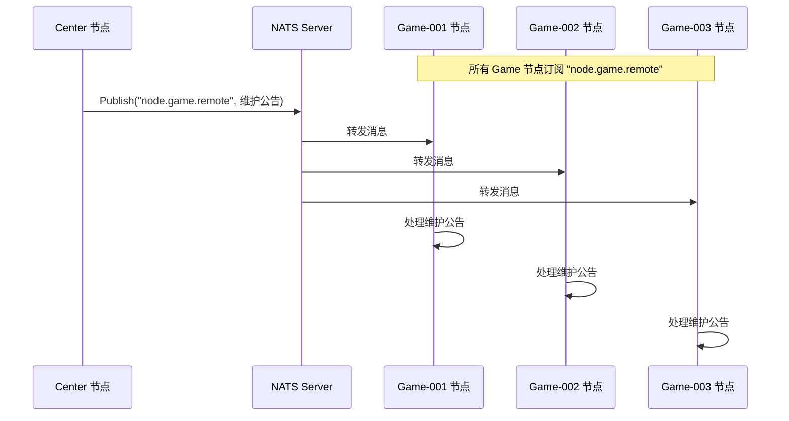
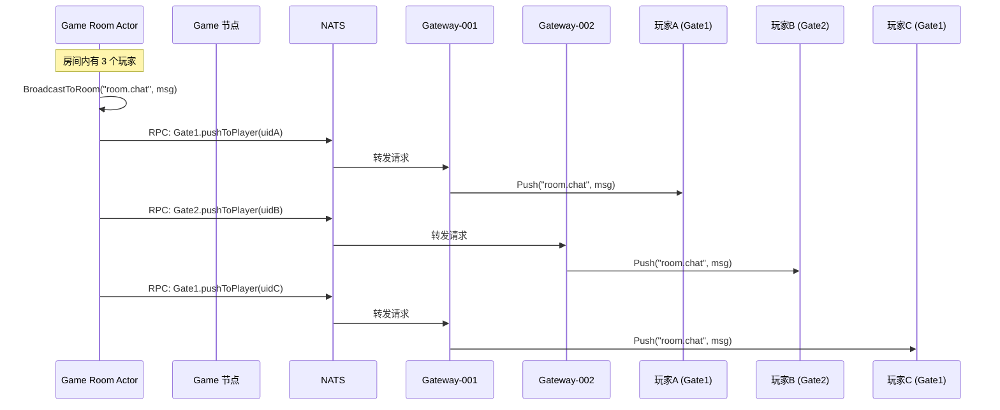
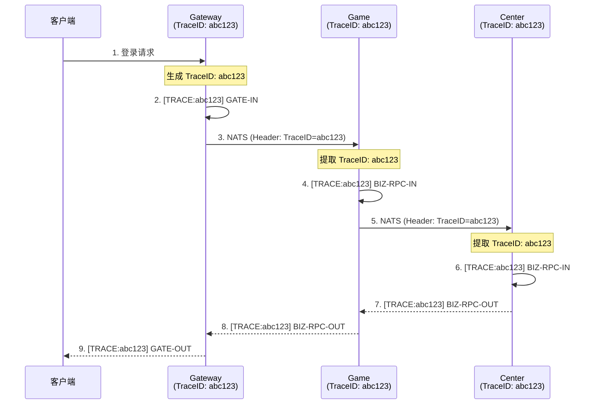

# Cherry 框架广播与链路追踪详解

## 一、服务节点广播机制

### 1.1 广播所有服务节点（PublishRemoteType）

Cherry 框架通过 **NATS** 的发布/订阅模式实现服务节点广播。

#### 核心方法

```go
// 广播到某类型的所有节点
func (p *Cluster) PublishRemoteType(nodeType string, cpacket *ClusterPacket) error {
    // 1. 检查目标节点类型是否存在
    if members := p.app.Discovery().ListByType(nodeType); len(members) < 1 {
        return cerror.ClusterNodeTypeMemberNotFound
    }
    
    // 2. 序列化消息
    bytes := proto.Marshal(cpacket)
    
    // 3. 构造 NATS Subject（关键！）
    subject := GetRemoteTypeSubject(p.prefix, nodeType)
    // 例如: "node.game.remote"（所有 game 节点都订阅这个 Subject）
    
    // 4. 发布消息到 NATS
    nats.Publish(subject, bytes)
    
    return nil
}
```

#### NATS Subject 命名规则

```
单播（点对点）: node.{nodeType}.{nodeID}.remote  // 如: node.game.game-001.remote
广播（一对多）: node.{nodeType}.remote           // 如: node.game.remote
```

#### 广播流程图



### 1.2 广播实现示例

#### 示例 1：广播维护公告

```go
// Center 节点广播维护公告到所有 Game 节点
func BroadcastMaintenance(app cfacade.IApplication, msg string) {
    req := &pb.MaintenanceNotice{
        Message: msg,
        StartTime: time.Now().Unix(),
    }
    
    // 广播到所有 game 节点
    app.Call("", "game", "player.onMaintenance", req)
}
```

#### 示例 2：广播配置更新

```go
// 配置热更新：通知所有节点重新加载配置
func BroadcastConfigReload(app cfacade.IApplication, configType string) {
    req := &pb.ConfigReloadReq{
        ConfigType: configType,
    }
    
    // 广播到所有 gate 节点
    app.CallType("gate", "config", "reloadConfig", req)
    
    // 广播到所有 game 节点
    app.CallType("game", "config", "reloadConfig", req)
}
```

### 1.3 订阅广播消息

```go
// 在 cluster.go 的 Init() 方法中自动订阅
func (p *Cluster) remoteTypeProcess() {
    process := func(natsMsg *nats.Msg) {
        packet := UnmarshalPacket(natsMsg.Data)
        message := BuildClusterMessage(packet)
        
        // 投递到本节点的 Actor 系统处理
        p.app.ActorSystem().PostRemote(&message)
    }
    
    // 订阅本节点类型的广播 Subject
    // 例如：game 节点订阅 "node.game.remote"
    conn.Subscribe(p.remoteTypeSubject, process)
}
```

---

## 二、客户端广播机制

### 2.1 单个客户端推送（Push）

```go
// Agent.Push 推送消息到单个客户端
func (a *Agent) Push(route string, val interface{}) {
    clog.Infof("[GATE-PUSH] uid=%d, sid=%s, route=%s", 
        a.UID(), a.SID(), route)
    
    // 构造推送消息
    a.sendPending(pomeloMessage.Push, route, 0, val, false)
}
```

**使用示例：**
```go
// 推送游戏事件给玩家
func PushGameEvent(agent *pomelo.Agent, event *pb.GameEvent) {
    agent.Push("game.event", event)
}
```

### 2.2 广播给多个客户端

Cherry 框架没有直接的"广播给所有客户端"的 API，需要自己实现。有两种常见方案：

#### 方案一：遍历 Agent 列表推送

```go
// 广播给所有在线玩家
func BroadcastToAllPlayers(route string, msg interface{}) {
    // 1. 获取所有在线 Agent
    agents := pomelo.GetAllAgents()
    
    // 2. 遍历推送
    for _, agent := range agents {
        agent.Push(route, msg)
    }
}

// 广播给指定 UID 列表
func BroadcastToPlayers(uids []cfacade.UID, route string, msg interface{}) {
    for _, uid := range uids {
        if agent, ok := pomelo.GetAgent("", uid); ok {
            agent.Push(route, msg)
        }
    }
}
```

#### 方案二：基于 Room/Channel 的广播（推荐）

```go
// Room Actor 管理一组玩家
type RoomActor struct {
    players map[cfacade.UID]*PlayerInfo // 房间内的玩家
}

// 广播给房间内所有玩家
func (r *RoomActor) BroadcastToRoom(route string, msg interface{}) {
    for uid := range r.players {
        // 调用 Gateway 的推送接口
        r.CallGatewayPush(uid, route, msg)
    }
}

// 调用 Gateway 推送（跨节点）
func (r *RoomActor) CallGatewayPush(uid cfacade.UID, route string, msg interface{}) {
    // 1. 查询玩家所在的 Gateway 节点
    gateNode, err := r.GetPlayerGateway(uid)
    if err != nil {
        return
    }
    
    // 2. 调用 Gateway 节点的 Agent 推送
    req := &pb.PushRequest{
        Uid:   uid,
        Route: route,
        Data:  msg,
    }
    
    targetPath := cfacade.NewPath(gateNode, "user")
    r.Call(targetPath, "pushToPlayer", req)
}
```

#### Gateway 节点实现推送接口

```go
// ActorUser (Gateway 的父 Actor)
func (p *ActorUser) OnInit() {
    p.Remote().Register("pushToPlayer", p.pushToPlayer)
}

func (p *ActorUser) pushToPlayer(req *pb.PushRequest) {
    // 获取目标 Agent
    if agent, ok := pomelo.GetAgent("", req.Uid); ok {
        agent.Push(req.Route, req.Data)
    }
}
```

### 2.3 广播流程图（基于 Room）



---

## 三、链路追踪（Distributed Tracing）

### 3.1 当前日志系统

Cherry 框架目前通过 **结构化日志** 实现简单的链路追踪：

```
[GATE-IN] route=gate.user.login, uid=0, sid=abc123, mid=1
[BIZ-IN] uid=0, sid=abc123, route=gate->user, funcName=login
[BIZ-RPC-IN] source=gate-001, target=center-001->account, funcName=devLogin
[BIZ-RPC-OUT] source=gate-001, target=center-001->account, code=0
[GATE-OUT] route=gate.user, uid=2126001, sid=abc123, mid=1, code=0
```

**追踪方式：**
- 通过 `mid`（Message ID）关联请求和响应
- 通过 `sid`（Session ID）关联同一连接的消息
- 通过 `uid`（User ID）关联同一用户的操作

### 3.2 链路追踪的缺陷

当前实现 **无法追踪跨节点的完整调用链**：

```
Client → Gateway → Game → Center → Database
         ↓         ↓       ↓
       [日志1]   [日志2] [日志3]  // 三个独立的日志，难以关联
```

### 3.3 实现完整链路追踪的方案

#### 方案一：集成 OpenTelemetry（推荐）

使用行业标准的分布式追踪框架。

**核心概念：**
- **Trace ID**：全局唯一，贯穿整个请求链路
- **Span ID**：单个操作的标识
- **Parent Span ID**：父级操作的标识

**实现步骤：**

1. **初始化 Tracer**
```go
import (
    "go.opentelemetry.io/otel"
    "go.opentelemetry.io/otel/exporters/jaeger"
    "go.opentelemetry.io/otel/sdk/trace"
)

func InitTracer() {
    // 配置 Jaeger Exporter
    exporter, _ := jaeger.New(jaeger.WithCollectorEndpoint(
        jaeger.WithEndpoint("http://localhost:14268/api/traces"),
    ))
    
    // 创建 TracerProvider
    tp := trace.NewTracerProvider(
        trace.WithBatcher(exporter),
        trace.WithResource(resource.NewWithAttributes(
            semconv.ServiceNameKey.String("cherry-game"),
        )),
    )
    
    otel.SetTracerProvider(tp)
}
```

2. **Gateway 层注入 Trace ID**
```go
func onPomeloDataRoute(agent, route, msg) {
    // 1. 生成或提取 Trace ID
    ctx := context.Background()
    tr := otel.Tracer("gateway")
    
    ctx, span := tr.Start(ctx, "gateway.request")
    defer span.End()
    
    // 2. 将 Trace Context 注入到消息中
    carrier := propagation.MapCarrier{}
    otel.GetTextMapPropagator().Inject(ctx, carrier)
    
    msg.TraceID = carrier["traceparent"] // W3C Trace Context
    
    // 3. 处理请求
    processRequest(ctx, msg)
}
```

3. **NATS 消息传递 Trace ID**
```go
func (p *Cluster) PublishRemote(nodeID, packet) {
    // 将 Trace Context 添加到 NATS Header
    natsMsg := nats.NewMsg(subject)
    natsMsg.Header.Set("traceparent", packet.TraceID)
    natsMsg.Data = packet.Data
    
    nats.PublishMsg(natsMsg)
}
```

4. **接收端提取 Trace ID**
```go
func (p *Cluster) remoteProcess() {
    process := func(natsMsg *nats.Msg) {
        // 1. 提取 Trace Context
        carrier := propagation.MapCarrier{}
        carrier["traceparent"] = natsMsg.Header.Get("traceparent")
        
        ctx := otel.GetTextMapPropagator().Extract(
            context.Background(), 
            carrier,
        )
        
        // 2. 创建新的 Span
        tr := otel.Tracer("game")
        ctx, span := tr.Start(ctx, "game.handleRequest")
        defer span.End()
        
        // 3. 处理请求
        handleRequest(ctx, natsMsg)
    }
}
```

5. **业务层记录 Span**
```go
func (p *PlayerActor) login(ctx context.Context, req *pb.LoginReq) {
    tr := otel.Tracer("player")
    ctx, span := tr.Start(ctx, "player.login")
    defer span.End()
    
    // 记录属性
    span.SetAttributes(
        attribute.Int64("user.id", req.UserId),
        attribute.String("user.name", req.Username),
    )
    
    // 调用数据库
    user, err := p.loadUserFromDB(ctx, req.UserId)
    if err != nil {
        span.RecordError(err)
        span.SetStatus(codes.Error, err.Error())
    }
    
    return user
}
```

#### 方案二：自定义 Trace ID 传递（轻量级）

如果不想引入 OpenTelemetry，可以自己实现简单的链路追踪。

**核心思路：**
1. Gateway 生成全局唯一的 `TraceID`
2. 在所有消息中携带 `TraceID`
3. 所有日志打印 `TraceID`

**实现代码：**

```go
// 1. 生成 TraceID
func GenerateTraceID() string {
    return uuid.New().String() // 或使用 snowflake ID
}

// 2. Gateway 注入 TraceID
func onPomeloDataRoute(agent, route, msg) {
    traceID := GenerateTraceID()
    msg.TraceID = traceID
    
    clog.Infof("[TRACE:%s] [GATE-IN] route=%s, uid=%d, mid=%d",
        traceID, msg.Route, agent.UID(), msg.ID)
    
    processRequest(msg)
}

// 3. NATS 消息携带 TraceID
func (p *Cluster) PublishRemote(nodeID, packet) {
    natsMsg := nats.NewMsg(subject)
    natsMsg.Header.Set("TraceID", packet.TraceID) // 关键！
    natsMsg.Data = packet.Data
    
    nats.PublishMsg(natsMsg)
}

// 4. 接收端提取并继续传递
func (p *Cluster) remoteProcess() {
    process := func(natsMsg *nats.Msg) {
        traceID := natsMsg.Header.Get("TraceID")
        
        clog.Infof("[TRACE:%s] [BIZ-RPC-IN] target=%s",
            traceID, packet.TargetPath)
        
        // 继续传递 TraceID
        message.TraceID = traceID
        p.app.ActorSystem().PostRemote(&message)
    }
}

// 5. 业务层打印日志
func (p *PlayerActor) login(msg *Message, req *pb.LoginReq) {
    clog.Infof("[TRACE:%s] [PLAYER-LOGIN] uid=%d",
        msg.TraceID, req.UserId)
    
    // 调用其他服务时继续传递 TraceID
    p.CallWithTrace(msg.TraceID, "center", "account.getUser", req)
}
```

### 3.4 链路追踪完整流程（带 TraceID）



**日志输出示例：**
```
[TRACE:abc123] [GATE-IN] route=gate.user.login, uid=0, sid=xyz, mid=1
[TRACE:abc123] [BIZ-RPC-IN] source=gate-001, target=game-001->player
[TRACE:abc123] [BIZ-RPC-IN] source=game-001, target=center-001->account
[TRACE:abc123] [BIZ-RPC-OUT] source=center-001, code=0
[TRACE:abc123] [BIZ-RPC-OUT] source=game-001, code=0
[TRACE:abc123] [GATE-OUT] uid=2126001, mid=1, code=0
```

**通过 TraceID 查询完整链路：**
```bash
# 使用 grep 查询完整调用链
grep "abc123" all_logs.txt
```

---

## 四、实现建议

### 4.1 服务节点广播

✅ **推荐做法：**
- 使用 `CallType()` 广播到某类型的所有节点
- 在 Actor 中注册 Remote 方法接收广播消息
- 用于配置更新、维护公告等场景

❌ **不推荐：**
- 频繁广播大量数据（影响 NATS 性能）
- 广播业务逻辑（应该用点对点 RPC）

### 4.2 客户端广播

✅ **推荐做法：**
- 使用 Room/Channel 模式管理玩家分组
- 通过 Gateway RPC 接口推送消息
- 异步推送，避免阻塞业务逻辑

❌ **不推荐：**
- 在 Game 节点直接遍历所有客户端（跨节点开销大）
- 同步等待推送完成（影响性能）

### 4.3 链路追踪

✅ **推荐做法：**
- 集成 OpenTelemetry（企业级方案）
- 或自定义 TraceID 传递（轻量级方案）
- 在 NATS Header 中传递 Trace Context
- 所有日志打印 TraceID

❌ **不推荐：**
- 仅依赖 UID/SID（无法追踪跨节点调用）
- 不记录 Span 层级关系（难以分析性能瓶颈）

---

## 五、代码示例汇总

### 5.1 服务节点广播示例

```go
// 广播维护公告到所有 Game 节点
func BroadcastMaintenance(app cfacade.IApplication) {
    notice := &pb.MaintenanceNotice{
        Message: "服务器将在 10 分钟后维护",
        Time:    time.Now().Unix(),
    }
    
    // 调用所有 game 节点的 player.onMaintenance
    app.CallType("game", "player", "onMaintenance", notice)
}
```

### 5.2 客户端房间广播示例

```go
// Room Actor 广播聊天消息
func (r *RoomActor) BroadcastChat(senderUID cfacade.UID, msg string) {
    chatMsg := &pb.ChatMessage{
        SenderUID: senderUID,
        Message:   msg,
        Timestamp: time.Now().Unix(),
    }
    
    // 遍历房间内所有玩家
    for uid, player := range r.players {
        // 跨节点推送到 Gateway
        req := &pb.PushRequest{
            Uid:   uid,
            Route: "room.chat",
            Data:  chatMsg,
        }
        
        gateNode := player.GateNodeID
        targetPath := cfacade.NewPath(gateNode, "user")
        r.Call(targetPath, "pushToPlayer", req)
    }
}
```

### 5.3 链路追踪示例（自定义 TraceID）

```go
// Gateway 生成 TraceID
func onPomeloDataRoute(agent, route, msg) {
    traceID := uuid.New().String()
    msg.SetHeader("TraceID", traceID)
    
    clog.Infof("[TRACE:%s] [GATE-IN] route=%s", traceID, msg.Route)
    
    // 转发到 Game 节点（TraceID 自动携带在 Header 中）
    pomelo.ClusterLocalDataRoute(agent, session, route, msg, targetPath)
}
```

---

## 六、性能优化建议

### 6.1 广播优化

- **批量推送**：收集一批消息后统一推送
- **异步处理**：使用 goroutine 避免阻塞
- **消息压缩**：大消息使用 gzip 压缩

### 6.2 链路追踪优化

- **采样率**：生产环境只追踪 1%-10% 的请求
- **异步上报**：Span 数据异步发送到 Jaeger
- **本地聚合**：减少网络开销

---

**总结：Cherry 框架通过 NATS 实现灵活的服务节点广播，通过 Agent.Push 实现客户端推送，建议集成 OpenTelemetry 实现完整的分布式链路追踪。**
