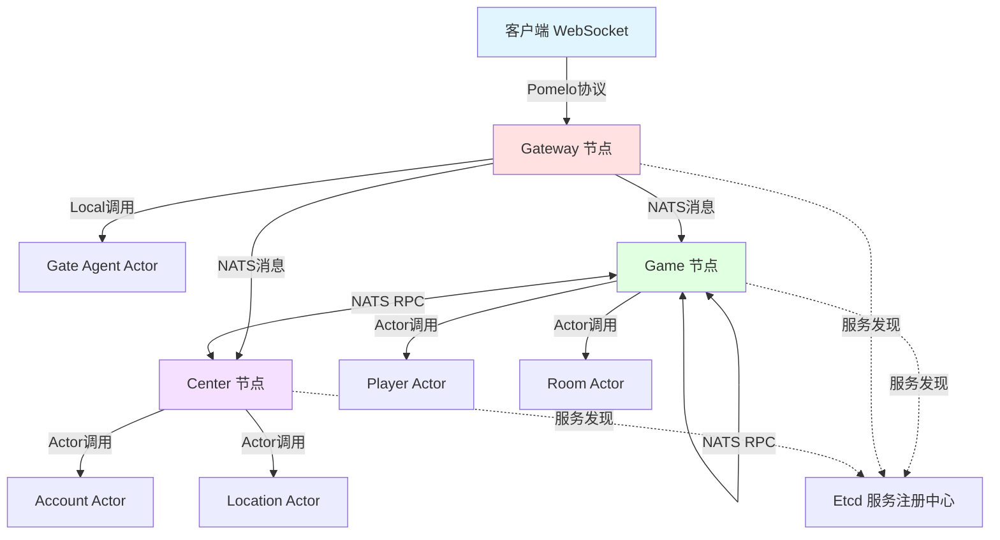
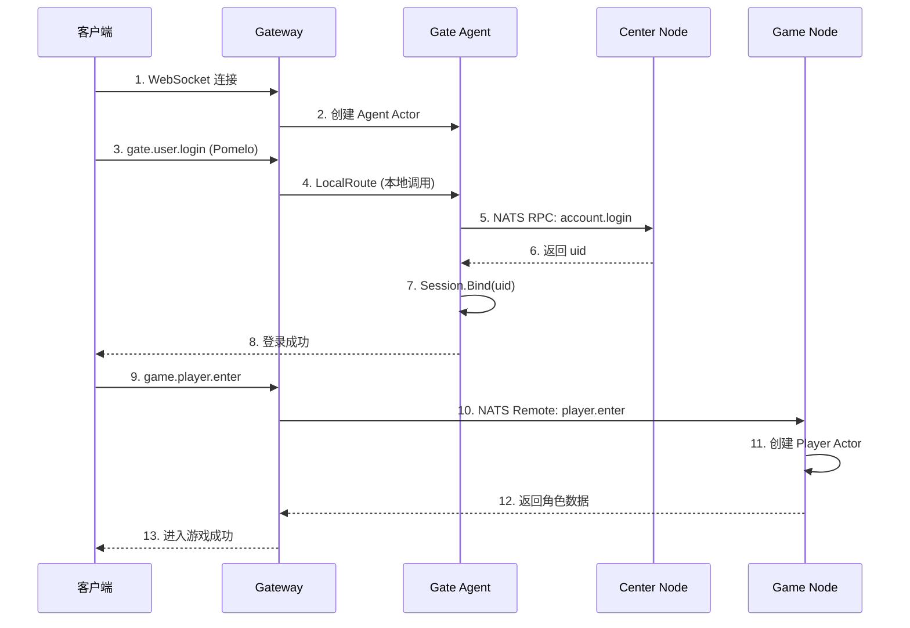
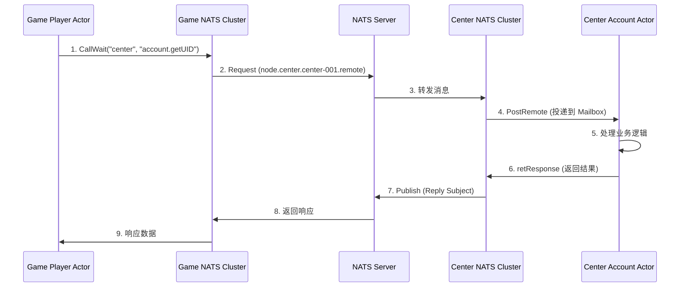

# Cherry 框架通信机制详解

## 一、整体架构概览



## 二、客户端与 Gateway 通信

### 2.1 通信协议：Pomelo

**通信流程：**
```
客户端 WebSocket ←→ Gateway (Pomelo 协议解析) ←→ Agent Actor
```

**关键组件：**
- **Pomelo Parser**：负责解析客户端的二进制消息
- **Agent Actor**：每个连接对应一个 Agent，管理会话状态
- **Session**：存储用户会话信息（uid、sid、自定义数据）

**消息格式（Pomelo）：**
```go
type Message struct {
    ID    uint32  // 消息ID（MID），用于匹配请求和响应
    Route string  // 路由，如 "gate.user.login"
    Data  []byte  // 业务数据（Protobuf）
}
```

**代码位置：**
- `3rd/cherry-game/cherry/net/parser/pomelo/`：协议解析
- `demo_cluster/nodes/gate/actor_agent.go`：Agent 实现

---

## 三、Gateway 与游戏服务器通信

### 3.1 路由转发机制

**路由规则（route.go）：**

```go
func onPomeloDataRoute(agent, route, msg) {
    // 1. 检查是否同节点（如 gate.user.login）
    if agent.NodeType() == route.NodeType() {
        // 本地调用：直接调用本节点的 Actor
        LocalDataRoute(agent, session, route, msg, targetPath)
    } else {
        // 跨节点调用：通过 NATS 转发到目标节点
        gameNodeRoute(agent, session, route, msg)
    }
}
```

**跨节点转发流程：**
```
1. Gateway 从 Session 中获取玩家绑定的 Game 节点 ID
2. 检查目标节点是否在线（通过服务发现）
3. 构造 ClusterPacket 消息
4. 通过 NATS 发送到目标节点的 Remote Subject
5. 目标节点接收消息，路由到对应的 Actor
```

**NATS Subject 命名规则：**
```
Local:  node.{nodeType}.{nodeID}.local   // 本节点内部消息
Remote: node.{nodeType}.{nodeID}.remote  // 跨节点调用
Type:   node.{nodeType}.remote           // 广播到某类型的所有节点
Reply:  node.{nodeType}.{nodeID}.reply   // 响应消息
```

---

## 四、服务与服务之间通信（RPC）

### 4.1 NATS 消息队列

Cherry 使用 **NATS** 作为服务间通信的消息中间件。

**通信模式：**
1. **Request-Response**：同步 RPC 调用（等待响应）
2. **Publish**：异步消息发送（不等待响应）

**示例：Game 节点调用 Center 节点**

```go
// Game 节点发起 RPC 调用
func AllocateNodes(app, userId, gateNodeId) {
    // 1. 构造请求参数
    req := &pb.AllocateNodesReq{
        UserId:     userId,
        GateNodeId: gateNodeId,
    }
    
    // 2. 调用 Center 节点的 Remote 函数
    resp := &pb.AllocateNodesResp{}
    code := app.Call(
        "center-001",              // 目标节点 ID
        "account.AllocateNodes",   // 目标函数
        req,                       // 请求参数
        resp,                      // 响应数据
    )
    
    return resp, code
}
```

**底层实现（cluster.go）：**
```go
func RequestRemote(nodeID, packet) {
    // 1. 序列化请求数据
    msg := proto.Marshal(packet)
    
    // 2. 构造 NATS Subject
    subject := "node.center.center-001.remote"
    
    // 3. 发送同步请求（等待响应）
    natsData := nats.RequestSync(subject, msg, timeout)
    
    // 4. 反序列化响应
    rsp := &Response{}
    proto.Unmarshal(natsData, rsp)
    
    return rsp.Data, rsp.Code
}
```

### 4.2 消息回复机制

**请求流程：**
```
Game 节点 → NATS Request → Center 节点 → 处理 → NATS Response → Game 节点
```

**代码实现：**
```go
// Center 节点接收请求
func remoteProcess(natsMsg) {
    // 1. 解析消息
    packet := UnmarshalPacket(natsMsg.Data)
    
    // 2. 构造 Message，包含 Reply Subject
    message := BuildClusterMessage(packet)
    message.Reply = natsMsg.Reply  // 响应地址
    
    // 3. 投递到 Actor 系统
    ActorSystem.PostRemote(message)
}

// Actor 处理完成后，发送响应
func retResponse(m *Message, rsp *Response) {
    // 1. 序列化响应
    rspData := proto.Marshal(rsp)
    
    // 2. 发送到 Reply Subject
    nats.Publish(m.Reply, rspData)
}
```

---

## 五、为什么使用反射而不是映射？

### 5.1 反射的优势

**Cherry 使用反射的原因：**

1. **类型安全**：在编译时确保函数签名正确
2. **自动参数解析**：无需手动编写序列化/反序列化代码
3. **统一调用接口**：Local 和 Remote 使用相同的调用方式
4. **减少样板代码**：开发者只需定义业务函数

**反射调用流程：**
```go
// 1. 注册阶段：解析函数信息
func Register(handler interface{}) {
    funcInfo := reflect.ValueOf(handler).Type()
    // 存储函数签名、参数类型等信息
}

// 2. 调用阶段：动态调用
func Invoke(funcInfo, args) {
    // 根据类型信息反序列化参数
    argValue := reflect.New(funcInfo.InArgs[0])
    Unmarshal(args, argValue)
    
    // 反射调用函数
    results := funcInfo.Value.Call([]reflect.Value{argValue})
    
    // 处理返回值
    return results
}
```

### 5.2 与直接映射的对比

**如果使用 Map[string]func([]byte) []byte：**

❌ **缺点：**
- 需要手动序列化/反序列化每个参数
- 失去类型安全性
- 大量重复代码
- 难以维护

✅ **反射的好处：**
- 框架自动处理序列化
- 编译时类型检查
- 代码简洁优雅

---

## 六、Local 和 Remote 的区别与必要性

### 6.1 设计理念

**Local（本地消息）：**
- 来自客户端的请求
- 在同一节点内处理
- 不需要网络序列化
- 更快的执行速度

**Remote（远程消息）：**
- 来自其他节点的 RPC 调用
- 需要跨网络传输
- 必须序列化参数
- 有网络延迟

### 6.2 为什么要分开？

#### 原因一：性能优化
```
Local 调用：直接内存传递 → 0 序列化开销
Remote 调用：网络传输 → 必须序列化
```

#### 原因二：参数签名不同
```go
// Local 函数（带 Session）
func Login(session *Session, req *LoginReq) (*LoginResp, int32) {
    // 可以直接访问 session.Uid、session.Sid
}

// Remote 函数（无 Session）
func GetPlayerData(req *GetPlayerReq) (*PlayerData, int32) {
    // 跨节点调用，没有 session 上下文
}
```

#### 原因三：路由策略不同
```go
// Local 路由：根据 Session 状态决定
if !session.IsBind() {
    return // 未登录，拒绝请求
}

// Remote 路由：根据目标节点路由
targetNodeID := discovery.FindNode("game")
cluster.CallRemote(targetNodeID, "player.getData", req)
```

### 6.3 自己节点调用自己为何也用 Remote？

**场景：同节点的不同 Actor 之间调用**

```go
// Player Actor 调用同节点的 Room Actor
func (p *PlayerActor) JoinRoom(roomID string) {
    // 虽然在同节点，但使用 Remote 调用
    p.CallWait("game-001/room/room-123", "join", req, resp)
}
```

**原因：**
1. **Actor 隔离**：每个 Actor 独立的 Mailbox，消息串行处理
2. **统一接口**：无论目标 Actor 在哪，都用相同的调用方式
3. **解耦设计**：调用者不需要知道目标是本地还是远程

**与直接函数调用的区别：**
```go
// ❌ 直接调用：破坏 Actor 模型，可能并发问题
room.Join(player)

// ✅ Remote 调用：通过 Mailbox 串行化，线程安全
CallWait("room.join", req)
```

---

## 七、消息流转完整示例

### 7.1 客户端登录流程



### 7.2 跨节点 RPC 调用



---

## 八、日志追踪示例

### 8.1 完整请求日志

```
[GATE-IN] route=gate.user.login, uid=0, sid=abc123, mid=1, size=128 bytes
[BIZ-IN] uid=0, sid=abc123, route=gate->user, funcName=login
[BIZ-RPC-IN] source=gate-001, target=center-001->account, funcName=devLogin
[BIZ-RPC-OUT] source=gate-001, target=center-001->account, code=0
[GATE-OUT] route=gate.user, uid=2126001, sid=abc123, mid=1, code=0
```

### 8.2 日志分层说明

| 层级 | 前缀 | 说明 |
|-----|------|-----|
| Gateway 层 | `[GATE-IN/OUT]` | 记录客户端消息收发 |
| 业务层 | `[BIZ-IN]` | 本地 Actor 调用 |
| RPC 层 | `[BIZ-RPC-IN/OUT]` | 跨节点 RPC 调用 |

---

## 九、架构优势总结

### 9.1 为什么这么设计？

1. **Actor 模型保证线程安全**
   - 每个 Actor 串行处理消息
   - 无需锁，避免并发问题

2. **Local/Remote 分离提升性能**
   - Local 零拷贝，极快响应
   - Remote 只在必要时序列化

3. **NATS 提供弹性伸缩**
   - 动态增减节点
   - 负载均衡
   - 故障容错

4. **反射简化开发**
   - 自动参数解析
   - 类型安全
   - 减少样板代码

### 9.2 复杂度换来的收益

虽然看起来复杂，但带来了：
- ✅ 高性能（本地调用快，远程调用按需）
- ✅ 高可用（节点故障自动转移）
- ✅ 易扩展（横向扩展游戏服务器）
- ✅ 易维护（统一的调用接口）

---

## 十、关键代码位置

| 功能 | 文件路径 |
|-----|---------|
| Pomelo 协议解析 | `3rd/cherry-game/cherry/net/parser/pomelo/` |
| Gateway 路由 | `demo_cluster/nodes/gate/route.go` |
| Actor 系统 | `3rd/cherry-game/cherry/net/actor/actor.go` |
| 反射调用 | `3rd/cherry-game/cherry/net/actor/invoke.go` |
| NATS 集群 | `3rd/cherry-game/cherry/net/cluster/nats_cluster/cluster.go` |
| 服务发现 | `3rd/cherry-game/cherry/net/discovery/` |

---

## 十一、常见问题

### Q1: 为什么不用 HTTP/gRPC？
A: NATS 更轻量，支持发布/订阅，适合游戏服务器的高并发场景。

### Q2: Actor 模型的性能开销大吗？
A: Mailbox 使用无锁队列，goroutine 调度极快，开销可忽略。

### Q3: 如何调试跨节点调用？
A: 查看日志的 `[BIZ-RPC-IN/OUT]`，根据 source/target 追踪调用链。

### Q4: 节点宕机怎么办？
A: Etcd 实时监控节点状态，Gateway 会自动重新分配可用节点。

---

**总结：Cherry 框架通过 Actor 模型 + NATS + 反射，实现了高性能、高可用的分布式游戏服务器架构。虽然初看复杂，但这种设计在大规模游戏中具有显著优势。**
