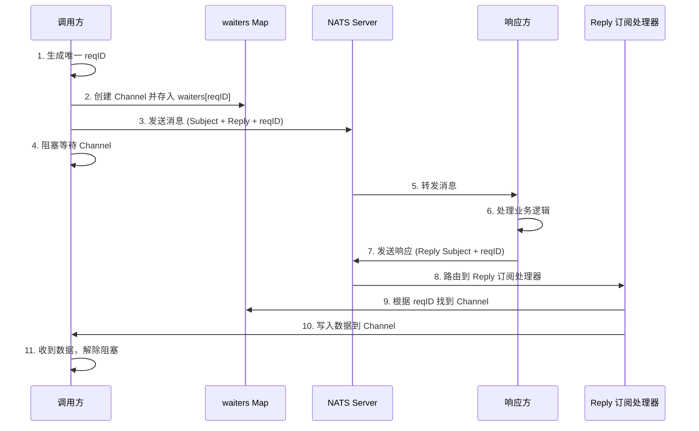
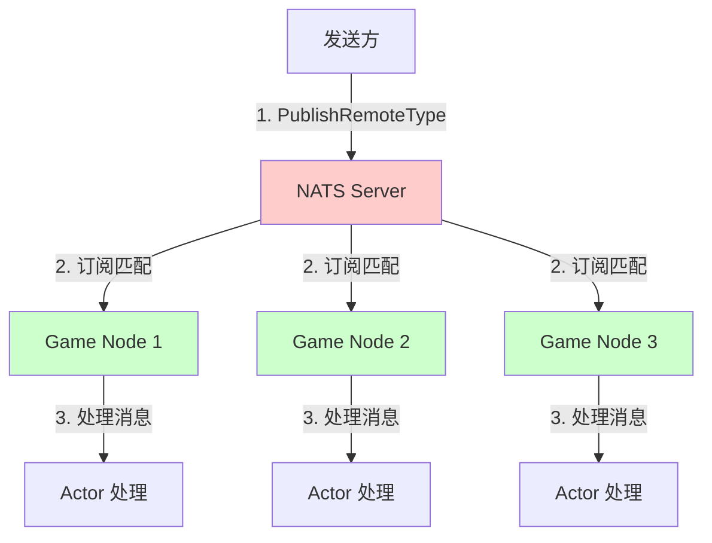
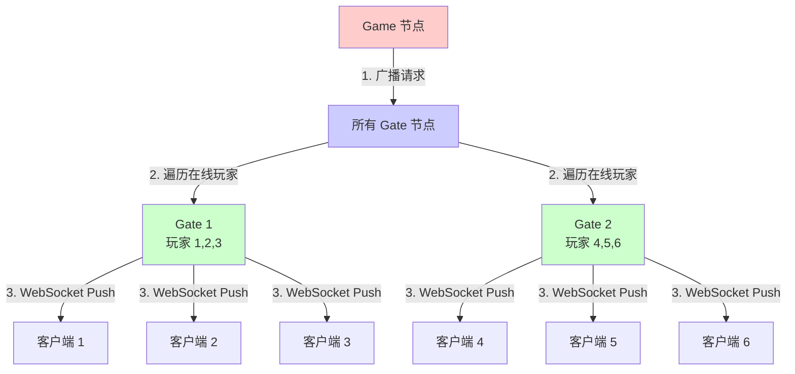

# NATS 同步调用与广播机制详解

## 一、NATS RequestSync 同步实现原理

### 1.1 核心问题

**NATS 本身是异步消息队列，如何实现同步 RPC 调用？**

答案：**通过 Channel + 请求 ID 匹配实现伪同步**

### 1.2 实现机制详解



### 1.3 核心代码解析

```go
func (p *Connect) RequestSync(subject string, data []byte, tod ...time.Duration) ([]byte, error) {
    // ============ 第一步：准备请求 ============
    timeout := GetTimeout(tod...)
    
    // 1. 生成唯一的请求 ID（原子递增，保证唯一性）
    reqID := strconv.FormatUint(atomic.AddUint64(&p.seq, 1), 10)
    
    // 2. 创建一个 Channel 用于接收响应（缓冲大小为 1）
    ch := make(chan *nats.Msg, 1)
    
    // 3. 将 Channel 存入 waiters Map（key=reqID, value=channel）
    p.waiters.Store(reqID, ch)
    
    // ============ 第二步：构造并发送消息 ============
    msg := GetMsg()
    msg.Subject = subject              // 目标 Subject
    msg.Reply = p.reply                // 响应地址（自己的 Reply Subject）
    msg.Header.Set(REQ_ID, reqID)      // 请求 ID（用于匹配响应）
    msg.Header.Set(CON_ID, strconv.FormatInt(int64(p.id), 10))  // 连接 ID
    msg.Data = data                    // 请求数据
    
    // 发送消息到 NATS
    err := p.PublishMsg(msg)
    ReleaseMsg(msg)
    
    if err != nil {
        p.waiters.Delete(reqID)  // 发送失败，清理 waiters
        close(ch)
        return nil, err
    }
    
    // ============ 第三步：等待响应（阻塞）============
    select {
    case resp, ok := <-ch:  // 阻塞等待 Channel 收到数据
        if !ok || resp == nil {
            return nil, cerror.ClusterRequestTimeout
        }
        return resp.Data, nil  // 返回响应数据
        
    case <-time.After(timeout):  // 超时
        p.waiters.Delete(reqID)  // 清理 waiters
        close(ch)
        return nil, cerror.ClusterRequestTimeout
    }
}
```

### 1.4 响应处理机制

**Reply Subject 订阅处理器：**

```go
func (p *Connect) initReplySubscribe() {
    // 订阅自己的 Reply Subject（格式：node.gate.gate-001.reply.1）
    p.Subscribe(p.reply, func(msg *nats.Msg) {
        // 1. 从消息 Header 中提取 reqID
        reqID := msg.Header.Get(REQ_ID)
        if reqID == "" {
            return  // 没有 reqID，丢弃消息
        }
        
        // 2. 从 waiters 中找到对应的 Channel
        if chMsg, ok := p.waiters.LoadAndDelete(reqID); ok {
            ch := chMsg.(chan *nats.Msg)
            
            // 3. 将响应消息写入 Channel（唤醒等待的 goroutine）
            select {
            case ch <- msg:  // 成功写入
            default:         // Channel 已关闭或已满，丢弃
            }
            close(ch)  // 关闭 Channel
        }
    })
}
```

### 1.5 关键点总结

| 关键机制 | 说明 |
|---------|-----|
| **请求 ID** | 原子递增生成，保证唯一性 |
| **waiters Map** | 存储 reqID → Channel 的映射 |
| **Channel 阻塞** | 调用方通过 `<-ch` 阻塞等待响应 |
| **Reply Subject** | 每个连接有独立的 Reply Subject |
| **超时机制** | 使用 `time.After()` 实现超时控制 |

### 1.6 与 NATS 原生 Request 的区别

| 方式 | Cherry RequestSync | NATS 原生 Request |
|-----|-------------------|-------------------|
| 实现 | 手动管理 waiters + Channel | NATS 内部实现 |
| 连接池 | 支持连接池，负载均衡 | 单个连接 |
| 请求 ID | 自定义 Header 传递 | NATS 内部管理 |
| 灵活性 | 可自定义超时、重试等 | 固定行为 |

---

## 二、广播服务节点机制

### 2.1 广播到所有同类型节点

**使用场景：**
- 全服公告
- 配置热更新
- 清理缓存

**实现方式：PublishRemoteType**

```go
// 广播到所有 Game 节点
func (p *Cluster) PublishRemoteType(nodeType string, cpacket *cproto.ClusterPacket) error {
    defer cpacket.Recycle()
    
    // 1. 序列化消息
    bytes, err := proto.Marshal(cpacket)
    if err != nil {
        return cerror.ClusterPacketMarshalFail
    }
    
    // 2. 检查目标类型节点是否存在
    if members := p.app.Discovery().ListByType(nodeType); len(members) < 1 {
        return cerror.ClusterNodeTypeMemberNotFound
    }
    
    // 3. 发布到类型 Subject（node.game.remote）
    subject := GetRemoteTypeSubject(p.prefix, nodeType)
    err = cnats.GetConnect().Publish(subject, bytes)
    
    return err
}
```

**NATS Subject 命名规则：**
```
单节点：node.game.game-001.remote  → 只有 game-001 接收
类型广播：node.game.remote         → 所有 game 节点接收
```

### 2.2 广播流程图



### 2.3 实际使用示例

**示例 1：全服公告**

```go
// Center 节点广播公告到所有 Game 节点
func BroadcastAnnouncement(app cfacade.IApplication, content string) {
    packet := &cproto.ClusterPacket{
        SourcePath: "center-001",
        TargetPath: "announcement",  // 目标 Actor
        FuncName:   "Notify",
        ArgBytes:   []byte(content),
    }
    
    // 广播到所有 game 节点
    app.Cluster().PublishRemoteType("game", packet)
}
```

**示例 2：配置热更新**

```go
// 通知所有节点重新加载配置
func ReloadConfig(app cfacade.IApplication, configName string) {
    packet := &cproto.ClusterPacket{
        SourcePath: "center-001",
        TargetPath: "config",
        FuncName:   "Reload",
        ArgBytes:   []byte(configName),
    }
    
    // 广播到所有 game 节点
    app.Cluster().PublishRemoteType("game", packet)
    
    // 广播到所有 gate 节点
    app.Cluster().PublishRemoteType("gate", packet)
}
```

### 2.4 订阅处理

**每个节点启动时订阅类型 Subject：**

```go
func (p *Cluster) remoteTypeProcess() {
    process := func(natsMsg *nats.Msg) {
        packet, err := cproto.UnmarshalPacket(natsMsg.Data)
        defer packet.Recycle()
        
        if err != nil {
            return
        }
        
        message := cfacade.BuildClusterMessage(packet)
        
        // 投递到 Actor 系统处理
        p.app.ActorSystem().PostRemote(&message)
    }
    
    // 订阅 node.game.remote（所有 game 节点都会收到）
    conn := cnats.GetConnect()
    err := conn.Subscribe(p.remoteTypeSubject, process)
}
```

---

## 三、广播给客户端

### 3.1 单个客户端推送

```go
// Agent 推送消息给客户端
func (agent *pomelo.Agent) Push(route string, data interface{}) {
    // 1. 序列化数据
    bytes, _ := proto.Marshal(data)
    
    // 2. 构造 Pomelo 消息
    msg := &pmessage.Message{
        Type:  pmessage.Push,  // 推送类型（不需要响应）
        Route: route,
        Data:  bytes,
    }
    
    // 3. 发送到 WebSocket 连接
    agent.Send(msg)
}
```

### 3.2 房间内广播

**场景：游戏房间内广播消息给所有玩家**

```go
// Room Actor 广播消息
type RoomActor struct {
    players map[int64]*PlayerInfo  // 房间内的玩家
}

func (r *RoomActor) BroadcastToRoom(route string, data interface{}) {
    // 遍历房间内所有玩家
    for uid, player := range r.players {
        // 1. 找到玩家所在的 Gate 节点
        gateNodeID := player.GateNodeID
        
        // 2. 构造推送消息
        packet := &cproto.ClusterPacket{
            SourcePath: r.Path(),
            TargetPath: fmt.Sprintf("%s/agent/%d", gateNodeID, uid),
            FuncName:   "Push",
            ArgBytes:   data,
        }
        
        // 3. 发送到 Gate 节点
        r.App().Cluster().PublishLocal(gateNodeID, packet)
    }
}
```

### 3.3 全服广播

**场景：全服公告、系统维护通知**



**实现代码：**

```go
// Game 节点：触发全服广播
func BroadcastToAllPlayers(app cfacade.IApplication, route string, data interface{}) {
    // 1. 序列化数据
    bytes, _ := proto.Marshal(data)
    
    packet := &cproto.ClusterPacket{
        SourcePath: "game-001",
        TargetPath: "broadcast",  // Gate 节点的广播 Actor
        FuncName:   "PushAll",
        ArgBytes:   bytes,
    }
    
    // 2. 广播到所有 Gate 节点
    app.Cluster().PublishRemoteType("gate", packet)
}

// Gate 节点：Broadcast Actor 处理
type BroadcastActor struct {
    agents sync.Map  // 所有在线的 Agent
}

func (b *BroadcastActor) PushAll(req *pb.BroadcastReq) {
    // 遍历所有在线 Agent
    b.agents.Range(func(key, value interface{}) bool {
        agent := value.(*pomelo.Agent)
        
        // 推送消息给客户端
        agent.Push(req.Route, req.Data)
        return true
    })
}
```

---

## 四、链路追踪实现方案

### 4.1 当前日志追踪

**Cherry 框架已实现的日志追踪：**

```
[GATE-IN] route=gate.user.login, uid=2126001, sid=abc123, mid=1
[BIZ-IN] uid=2126001, sid=abc123, route=gate->user, funcName=login
[BIZ-RPC-IN] source=gate-001, target=center-001->account, funcName=devLogin
[BIZ-RPC-OUT] source=gate-001, target=center-001->account, code=0
[GATE-OUT] route=gate.user, uid=2126001, sid=abc123, mid=1, code=0
```

**通过日志可以追踪：**
- 请求来源（uid、sid、mid）
- 调用链路（source、target）
- 执行结果（code）

### 4.2 增强链路追踪方案

**方案一：添加 Trace ID（推荐）**

```go
// 在 Message 结构体中添加 TraceID
type Message struct {
    TraceID  string  // 全局唯一的追踪 ID
    SpanID   string  // 当前调用的 Span ID
    ParentID string  // 父 Span ID
    // ... 其他字段
}

// 请求入口生成 TraceID
func onPomeloDataRoute(agent, route, msg) {
    // 生成全局唯一的 TraceID
    traceID := GenerateTraceID()
    
    message := BuildMessage(msg)
    message.TraceID = traceID
    message.SpanID = GenerateSpanID()
    
    // 记录日志
    clog.Infof("[GATE-IN] traceID=%s, spanID=%s, route=%s",
        traceID, message.SpanID, msg.Route)
}

// RPC 调用传递 TraceID
func Call(targetPath, funcName string, arg any) {
    packet := &ClusterPacket{
        TraceID:  currentMessage.TraceID,    // 传递 TraceID
        SpanID:   GenerateSpanID(),          // 新的 SpanID
        ParentID: currentMessage.SpanID,     // 记录父 SpanID
    }
    
    clog.Infof("[BIZ-RPC-OUT] traceID=%s, spanID=%s, parentID=%s",
        packet.TraceID, packet.SpanID, packet.ParentID)
}
```

**追踪日志示例：**
```
[GATE-IN] traceID=trace-001, spanID=span-1, route=gate.user.login
[BIZ-IN] traceID=trace-001, spanID=span-1, funcName=login
[BIZ-RPC-OUT] traceID=trace-001, spanID=span-2, parentID=span-1, target=center
[BIZ-RPC-IN] traceID=trace-001, spanID=span-2, parentID=span-1, funcName=devLogin
[BIZ-RPC-OUT] traceID=trace-001, spanID=span-2, code=0
[GATE-OUT] traceID=trace-001, spanID=span-1, code=0
```

### 4.3 集成 OpenTelemetry（企业级方案）

```go
import (
    "go.opentelemetry.io/otel"
    "go.opentelemetry.io/otel/trace"
)

// 在 Actor 调用时创建 Span
func InvokeRemoteFunc(app, fi, m) {
    ctx := context.Background()
    tracer := otel.Tracer("cherry-framework")
    
    // 创建 Span
    ctx, span := tracer.Start(ctx, "RPC."+m.FuncName,
        trace.WithAttributes(
            attribute.String("source", m.Source),
            attribute.String("target", m.Target),
        ),
    )
    defer span.End()
    
    // 业务逻辑
    result := fi.Value.Call(values)
    
    // 记录结果
    span.SetAttributes(attribute.Int("code", result.Code))
}
```

**可视化追踪（Jaeger）：**
```
gate.user.login (50ms)
  └─ center.account.devLogin (30ms)
       └─ db.query.user (20ms)
```

### 4.4 推荐方案

| 阶段 | 方案 | 成本 |
|-----|------|------|
| 初期 | TraceID + 结构化日志 | 低 |
| 中期 | TraceID + ELK 日志分析 | 中 |
| 成熟期 | OpenTelemetry + Jaeger | 高 |

---

## 五、总结对比

### 5.1 同步调用 vs 异步消息

| 特性 | RequestSync（同步） | Publish（异步） |
|-----|-------------------|----------------|
| 等待响应 | ✅ 阻塞等待 | ❌ 立即返回 |
| 超时控制 | ✅ 支持 | ❌ 无 |
| 性能 | 🐢 慢（需要等待） | 🚀 快（不等待） |
| 适用场景 | 查询数据、验证 | 通知、日志 |

### 5.2 广播方式对比

| 方式 | 目标 | NATS Subject | 适用场景 |
|-----|-----|-------------|---------|
| PublishLocal | 单节点 | node.game.game-001.local | 节点内 Actor 调用 |
| PublishRemote | 单节点 | node.game.game-001.remote | 跨节点 RPC |
| PublishRemoteType | 所有同类型节点 | node.game.remote | 全服广播 |

### 5.3 关键实现要点

1. **RequestSync 不是 NATS 特性**，是通过 **Channel + Map** 手动实现的同步机制
2. **广播利用 NATS 订阅机制**，多个订阅者订阅同一个 Subject
3. **链路追踪需要 TraceID 贯穿整个调用链**，记录在 Message Header 中

---

## 六、代码位置索引

| 功能 | 文件路径 |
|-----|---------|
| RequestSync 实现 | `3rd/cherry-game/cherry/net/nats/connect.go` |
| Reply 订阅处理 | `3rd/cherry-game/cherry/net/nats/connect.go:initReplySubscribe()` |
| PublishRemoteType | `3rd/cherry-game/cherry/net/cluster/nats_cluster/cluster.go` |
| 连接池管理 | `3rd/cherry-game/cherry/net/nats/pool.go` |
| Agent 推送 | `3rd/cherry-game/cherry/net/parser/pomelo/agent.go` |
| 日志拦截 | `3rd/cherry-game/cherry/net/actor/invoke.go` |

---

**总结：Cherry 框架通过精巧的设计，在异步消息队列之上实现了同步 RPC、广播和日志追踪，为分布式游戏服务器提供了完整的通信解决方案。**
