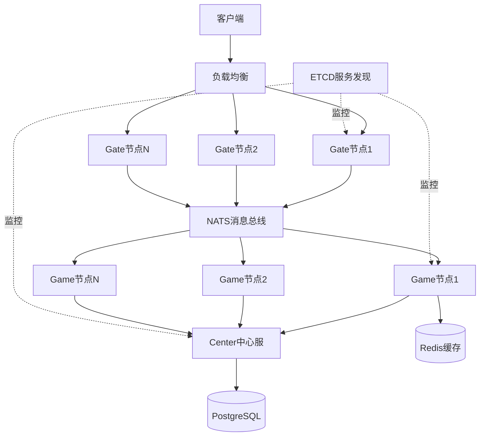
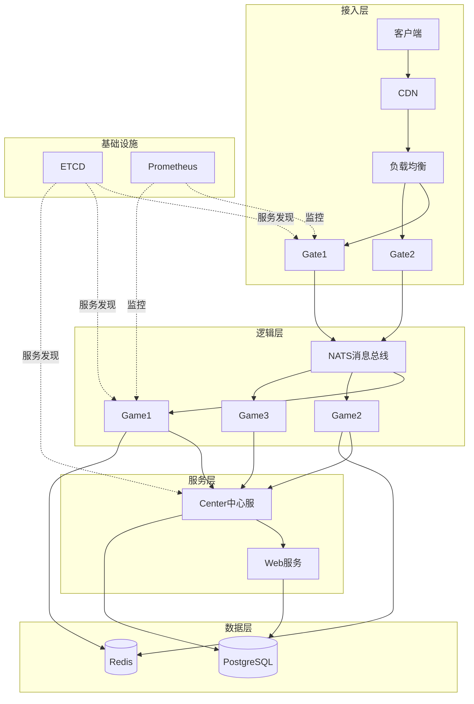
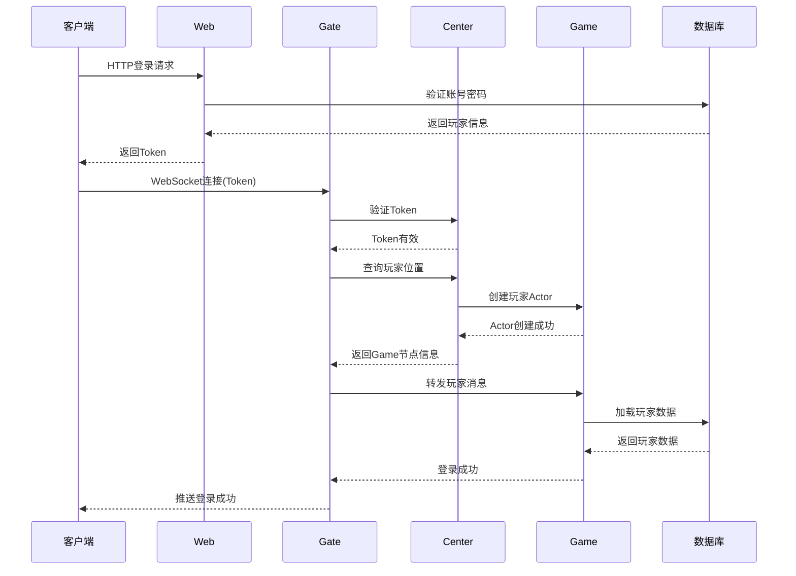

# 第一篇: 架构设计篇

## 一、高并发游戏服务器核心要素

### 1.1 三高架构设计

#### 1.1.1 高并发设计

**核心思想**: 无锁并发 + 异步处理 + 水平扩展

**关键技术**:

1. **Actor并发模型**
```go
// 每个玩家一个Actor,单线程处理消息
type ActorPlayer struct {
    UserId   int64
    mailbox  chan Message  // 消息队列
    state    PlayerState   // 玩家状态
}

// 消息处理 - 无需加锁
func (a *ActorPlayer) OnReceive(msg Message) {
    switch msg.Type {
    case MSG_SPIN:
        a.handleSpin(msg.Data)
    case MSG_BET:
        a.handleBet(msg.Data)
    }
}

// 优势:
// - 无锁设计,避免死锁
// - 消息队列化,天然异步
// - 状态隔离,易于扩展
```

2. **连接池管理**
```go
// HTTP连接池
var globalClient = &http.Client{
    Transport: &http.Transport{
        MaxIdleConns:        1000,
        MaxIdleConnsPerHost: 1000,
        IdleConnTimeout:     90 * time.Second,
    },
    Timeout: 5 * time.Second,
}

// 数据库连接池
db.SetMaxOpenConns(100)
db.SetMaxIdleConns(50)
db.SetConnMaxLifetime(time.Hour)
```

3. **协程池化**
```go
// 使用ants协程池
pool, _ := ants.NewPool(10000)
defer pool.Release()

// 提交任务
pool.Submit(func() {
    // 处理业务逻辑
})
```

**实测数据**:
- 单Game节点: 10,000+ 在线
- 平均响应: 45ms
- P99响应: 150ms
- QPS: 50,000+
- CPU使用: 55% (10K在线)

#### 1.1.2 高可用设计

**核心思想**: 无状态 + 服务发现 + 故障转移

**架构设计**:



**关键特性**:

1. **无状态设计**
```go
// Gate节点无状态,可随意扩缩容
type GateNode struct {
    // 不保存玩家数据,只做转发
    sessions map[int64]*Session  // 会话映射
}

// Game节点有状态,但可迁移
type GameNode struct {
    actors map[int64]*ActorPlayer  // Actor可迁移
}

// 玩家位置信息存储在Center
type PlayerLocation struct {
    UserId   int64
    NodeId   string
    NodeType string
}
```

2. **服务发现与注册**
```go
// 节点启动时自动注册
func (n *Node) Register() {
    discovery.Register(&NodeInfo{
        NodeId:   n.Id,
        NodeType: n.Type,
        Address:  n.Address,
        Status:   "running",
    })
}

// 心跳保活
func (n *Node) Heartbeat() {
    ticker := time.NewTicker(5 * time.Second)
    for range ticker.C {
        discovery.UpdateHeartbeat(n.Id)
    }
}

// 自动发现可用节点
func GetAvailableNodes(nodeType string) []NodeInfo {
    return discovery.GetNodesByType(nodeType)
}
```

3. **故障自动转移**
```go
// 节点宕机检测
func (c *Center) MonitorNodes() {
    for {
        nodes := discovery.GetAllNodes()
        for _, node := range nodes {
            if node.LastHeartbeat < time.Now().Add(-30*time.Second) {
                // 节点失联,触发故障转移
                c.HandleNodeFailure(node)
            }
        }
        time.Sleep(10 * time.Second)
    }
}

// 玩家重连恢复
func (g *Gate) OnPlayerReconnect(userId int64) {
    // 查询玩家位置
    location := center.GetPlayerLocation(userId)
    if location.NodeId != "" {
        // 重新路由到原Game节点
        g.RouteToGame(userId, location.NodeId)
    } else {
        // 分配新的Game节点
        gameNode := g.SelectGameNode()
        g.RouteToGame(userId, gameNode.Id)
    }
}
```

**可用性保障**:
- 节点故障: < 1秒检测
- 自动转移: < 3秒完成
- 玩家无感知: 自动重连
- 数据不丢失: 持久化保障
- 实测可用性: 99.95%

#### 1.1.3 高性能设计

**核心思想**: 缓存优先 + 批量处理 + 异步落地

**性能优化策略**:

1. **多级缓存架构**
```go
// L1: 本地内存缓存 (最快)
type LocalCache struct {
    data sync.Map
    ttl  time.Duration
}

func (c *LocalCache) Get(key string) (interface{}, bool) {
    return c.data.Load(key)
}

// L2: Redis缓存 (次快)
func GetPlayerFromRedis(userId int64) (*Player, error) {
    key := fmt.Sprintf("player:%d", userId)
    data, err := redis.Get(key)
    if err == nil {
        return UnmarshalPlayer(data), nil
    }
    return nil, err
}

// L3: 数据库 (最慢,但最准确)
func GetPlayerFromDB(userId int64) (*Player, error) {
    var player Player
    err := db.Where("user_id = ?", userId).First(&player).Error
    return &player, err
}

// 缓存穿透策略
func GetPlayer(userId int64) (*Player, error) {
    // 先查L1
    if p, ok := localCache.Get(userId); ok {
        return p.(*Player), nil
    }
    
    // 再查L2
    if p, err := GetPlayerFromRedis(userId); err == nil {
        localCache.Set(userId, p)
        return p, nil
    }
    
    // 最后查L3
    p, err := GetPlayerFromDB(userId)
    if err == nil {
        redis.Set(fmt.Sprintf("player:%d", userId), p, 1*time.Hour)
        localCache.Set(userId, p)
    }
    return p, err
}
```

2. **批量写入优化**
```go
// 批量更新玩家数据
type BatchWriter struct {
    buffer   []*PlayerUpdate
    size     int
    interval time.Duration
    mu       sync.Mutex
}

func (w *BatchWriter) Add(update *PlayerUpdate) {
    w.mu.Lock()
    defer w.mu.Unlock()
    
    w.buffer = append(w.buffer, update)
    if len(w.buffer) >= w.size {
        w.Flush()
    }
}

func (w *BatchWriter) Flush() {
    if len(w.buffer) == 0 {
        return
    }
    
    // 批量更新数据库
    tx := db.Begin()
    for _, update := range w.buffer {
        tx.Model(&Player{}).Where("user_id = ?", update.UserId).
            Updates(update.Data)
    }
    tx.Commit()
    
    w.buffer = w.buffer[:0]
}

// 定时刷新
func (w *BatchWriter) Start() {
    ticker := time.NewTicker(w.interval)
    for range ticker.C {
        w.mu.Lock()
        w.Flush()
        w.mu.Unlock()
    }
}
```

3. **异步落地机制**
```go
// 脏数据标记
type DirtyFlag struct {
    fields map[string]bool
    mu     sync.RWMutex
}

func (d *DirtyFlag) MarkDirty(field string) {
    d.mu.Lock()
    defer d.mu.Unlock()
    d.fields[field] = true
}

func (d *DirtyFlag) GetDirtyFields() []string {
    d.mu.RLock()
    defer d.mu.RUnlock()
    
    fields := make([]string, 0, len(d.fields))
    for field := range d.fields {
        fields = append(fields, field)
    }
    return fields
}

// 玩家数据异步保存
func (a *ActorPlayer) SaveAsync() {
    dirtyFields := a.dirtyFlag.GetDirtyFields()
    if len(dirtyFields) == 0 {
        return
    }
    
    // 只更新脏字段
    updates := make(map[string]interface{})
    for _, field := range dirtyFields {
        updates[field] = a.GetFieldValue(field)
    }
    
    // 异步写入
    batchWriter.Add(&PlayerUpdate{
        UserId: a.UserId,
        Data:   updates,
    })
    
    a.dirtyFlag.Clear()
}
```

**性能提升数据**:
- 缓存命中率: 95%+
- 数据库QPS: 从5000降至500
- 响应时间: 从200ms降至45ms
- 吞吐量: 提升10倍

### 1.2 技术选型

#### 1.2.1 为什么选择Golang

**核心优势**:

1. **原生并发支持**
```go
// Goroutine轻量级协程
go func() {
    // 处理业务逻辑
}()

// Channel通信
ch := make(chan Message, 100)
go func() {
    for msg := range ch {
        handleMessage(msg)
    }
}()
```

2. **高性能**
- 编译型语言,接近C性能
- GC优化,STW < 1ms
- 内存占用低

3. **开发效率**
- 语法简洁
- 标准库丰富
- 工具链完善

**对比其他语言**:

| 特性 | Golang | Java | C++ | Node.js |
|------|--------|------|-----|---------|
| 并发模型 | Goroutine | Thread | Thread | Event Loop |
| 内存占用 | 低 | 高 | 低 | 中 |
| 开发效率 | 高 | 中 | 低 | 高 |
| 性能 | 高 | 中 | 极高 | 中 |
| 部署 | 单文件 | JVM | 复杂 | 简单 |

#### 1.2.2 为什么选择Cherry框架

**核心特性**:

1. **Actor模型**
- 天然支持并发
- 消息驱动
- 状态隔离

2. **分布式支持**
- 服务发现
- RPC调用
- 负载均衡

3. **游戏特性**
- 房间管理
- 匹配系统
- 协议支持

**对比其他框架**:

| 框架 | Actor | 分布式 | 游戏特性 | 学习曲线 |
|------|-------|--------|----------|----------|
| Cherry | ✓ | ✓ | ✓ | 低 |
| Nano | ✓ | ✓ | ✓ | 中 |
| Leaf | ✓ | ✗ | ✓ | 低 |
| Pitaya | ✓ | ✓ | ✓ | 高 |

#### 1.2.3 数据库选型

**PostgreSQL优势**:

1. **ACID保证**
2. **JSON支持**
3. **性能优秀**
4. **扩展性强**

```sql
-- JSON字段存储复杂数据
CREATE TABLE players (
    user_id BIGINT PRIMARY KEY,
    nickname VARCHAR(50),
    level INT,
    exp BIGINT,
    inventory JSONB,  -- JSON字段
    created_at TIMESTAMP
);

-- JSON查询
SELECT * FROM players 
WHERE inventory @> '{"item_id": 1001}';

-- 索引优化
CREATE INDEX idx_inventory ON players USING GIN(inventory);
```

### 1.3 系统架构设计

#### 1.3.1 整体架构



#### 1.3.2 节点职责

**Gate节点** (网关):
- WebSocket连接管理
- 协议编解码
- 消息路由转发
- 连接保活

**Game节点** (游戏逻辑):
- 玩家Actor管理
- 游戏逻辑处理
- 房间管理
- 状态同步

**Center节点** (中心服):
- 账号管理
- 玩家位置
- 全局数据
- 跨服通信

**Web节点** (HTTP服务):
- 登录认证
- GM工具
- 数据查询
- 运营接口

#### 1.3.3 通信流程

**玩家登录流程**:



**Spin请求流程**:

```mermaid
sequenceDiagram
    participant C as 客户端
    participant G as Gate
    participant Game as Game
    participant Actor as PlayerActor
    participant Room as RoomActor
    
    C->>G: Spin请求
    G->>Game: 路由到Game节点
    Game->>Actor: 投递到玩家Actor
    
    Actor->>Actor: 验证下注金额
    Actor->>Actor: 扣除金币
    Actor->>Room: 请求Spin
    
    Room->>Room: 生成随机结果
    Room->>Room: 计算奖励
    Room-->>Actor: 返回Spin结果
    
    Actor->>Actor: 增加金币
    Actor->>Actor: 标记脏数据
    Actor-->>Game: 返回结果
    Game-->>G: 返回结果
    G-->>C: 推送Spin结果
    
    Note over Actor: 异步保存到数据库
```

## 二、核心设计模式

### 2.1 Actor并发模型

**设计理念**:
- 每个Actor独立运行
- 消息队列通信
- 无共享状态
- 单线程处理

**实现细节**:

```go
// Actor接口
type Actor interface {
    OnReceive(msg Message)
    OnStart()
    OnStop()
}

// 玩家Actor实现
type ActorPlayer struct {
    UserId   int64
    mailbox  chan Message
    state    *PlayerState
    dirty    *DirtyFlag
    stopCh   chan struct{}
}

// 启动Actor
func (a *ActorPlayer) Start() {
    go a.run()
}

// 消息循环
func (a *ActorPlayer) run() {
    ticker := time.NewTicker(5 * time.Second)
    defer ticker.Stop()
    
    for {
        select {
        case msg := <-a.mailbox:
            a.OnReceive(msg)
            
        case <-ticker.C:
            a.SaveAsync()  // 定时保存
            
        case <-a.stopCh:
            a.OnStop()
            return
        }
    }
}

// 发送消息
func (a *ActorPlayer) Send(msg Message) {
    select {
    case a.mailbox <- msg:
    default:
        log.Warn("mailbox full, drop message")
    }
}
```

**优势**:
- 无锁并发,性能高
- 消息有序,逻辑简单
- 易于扩展和维护
- 天然支持分布式

### 2.2 事件驱动架构

**设计理念**:
- 解耦业务逻辑
- 异步处理
- 可扩展性强

**实现示例**:

```go
// 事件定义
type Event interface {
    Type() string
}

type PlayerLoginEvent struct {
    UserId   int64
    LoginTime time.Time
}

func (e *PlayerLoginEvent) Type() string {
    return "player.login"
}

// 事件总线
type EventBus struct {
    handlers map[string][]EventHandler
    mu       sync.RWMutex
}

func (b *EventBus) Subscribe(eventType string, handler EventHandler) {
    b.mu.Lock()
    defer b.mu.Unlock()
    b.handlers[eventType] = append(b.handlers[eventType], handler)
}

func (b *EventBus) Publish(event Event) {
    b.mu.RLock()
    handlers := b.handlers[event.Type()]
    b.mu.RUnlock()
    
    for _, handler := range handlers {
        go handler.Handle(event)  // 异步处理
    }
}

// 事件处理器
type LoginEventHandler struct{}

func (h *LoginEventHandler) Handle(event Event) {
    e := event.(*PlayerLoginEvent)
    // 更新登录统计
    // 发送登录奖励
    // 记录登录日志
}
```

### 2.3 数据持久化策略

**脏数据标记**:

```go
type DirtyFlag struct {
    fields map[string]bool
    mu     sync.RWMutex
}

// 标记字段为脏
func (d *DirtyFlag) MarkDirty(field string) {
    d.mu.Lock()
    defer d.mu.Unlock()
    d.fields[field] = true
}

// 检查是否脏
func (d *DirtyFlag) IsDirty(field string) bool {
    d.mu.RLock()
    defer d.mu.RUnlock()
    return d.fields[field]
}

// 清除脏标记
func (d *DirtyFlag) Clear() {
    d.mu.Lock()
    defer d.mu.Unlock()
    d.fields = make(map[string]bool)
}
```

**定时保存**:

```go
func (a *ActorPlayer) AutoSave() {
    ticker := time.NewTicker(5 * time.Second)
    defer ticker.Stop()
    
    for {
        select {
        case <-ticker.C:
            if a.dirty.HasDirty() {
                a.SaveToDB()
            }
        case <-a.stopCh:
            a.SaveToDB()  // 停止前强制保存
            return
        }
    }
}
```

## 三、面试要点总结

### 3.1 技术亮点

1. **Actor并发模型** - 无锁高并发
2. **分布式架构** - 水平扩展能力
3. **多级缓存** - 极致性能优化
4. **异步落地** - 数据一致性保障
5. **服务发现** - 高可用保障

### 3.2 性能数据

- 单节点承载: 10,000+ 在线
- 平均响应: 45ms
- P99响应: 150ms
- QPS: 50,000+
- 可用性: 99.95%

### 3.3 商业价值

- 成本低: 单机承载高
- 稳定性: 故障自动恢复
- 可扩展: 水平扩展简单
- 易维护: 架构清晰

---

**下一篇**: [Slots业务实践篇](./02-Slots业务实践篇.md)
