# Cherry框架完整架构分析
github地址：https://github.com/cherry-game
## 目录
1. [框架整体架构](#1-框架整体架构)
2. [节点启动流程](#2-节点启动流程)
3. [Actor系统深度分析](#3-actor系统深度分析)
4. [模块系统分析](#4-模块系统分析)
5. [通信机制详解](#5-通信机制详解)
6. [服务发现与注册](#6-服务发现与注册)
7. [错误处理与容错](#7-错误处理与容错)
8. [最佳实践与应用场景](#8-最佳实践与应用场景)

---

## 1. 框架整体架构

### 1.1 Cherry框架分层架构

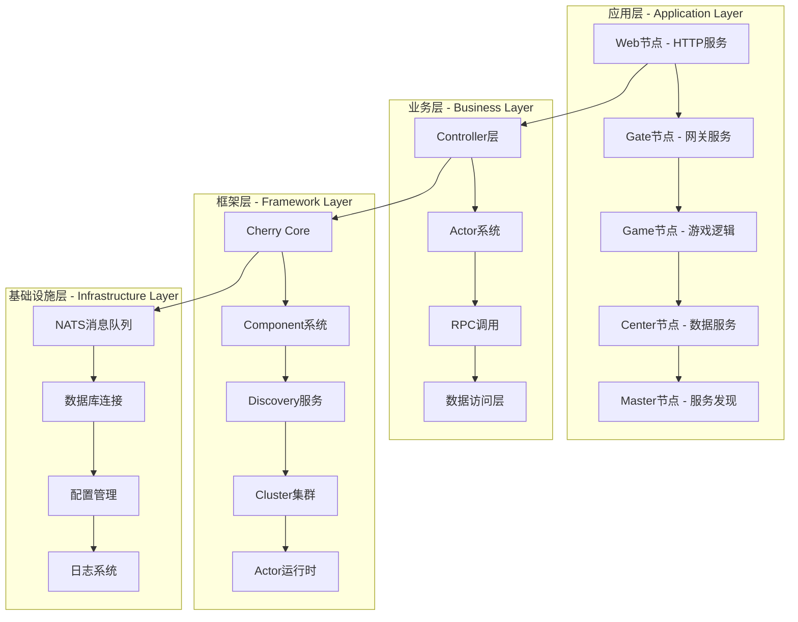

### 1.2 节点类型与职责

| 节点类型 | 主要职责 | 技术特点 | 通信方式 |
|---------|---------|---------|---------|
| **Master** | 服务发现、节点注册 | 单点管理、高可用 | NATS订阅/发布 |
| **Gate** | 客户端接入、消息路由 | 高并发、状态管理 | TCP/WebSocket + NATS |
| **Game** | 游戏逻辑、玩家管理 | Actor模型、业务处理 | NATS RPC |
| **Center** | 数据服务、账户管理 | 数据持久化、缓存 | NATS RPC + 数据库 |
| **Web** | HTTP API、管理后台 | RESTful、传统Web | HTTP + NATS RPC |

---

## 2. 节点启动流程

### 2.1 节点启动时序图

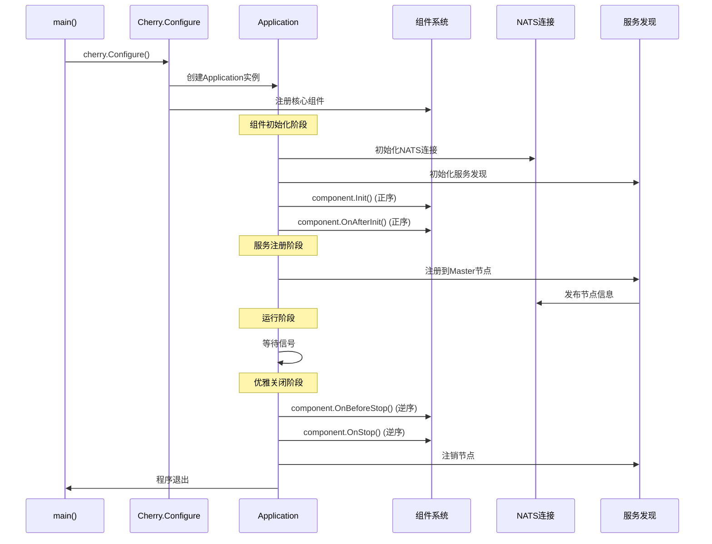

### 2.2 组件依赖关系

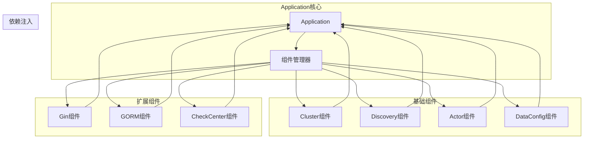

---

## 3. Actor系统深度分析

### 3.1 Actor架构层次

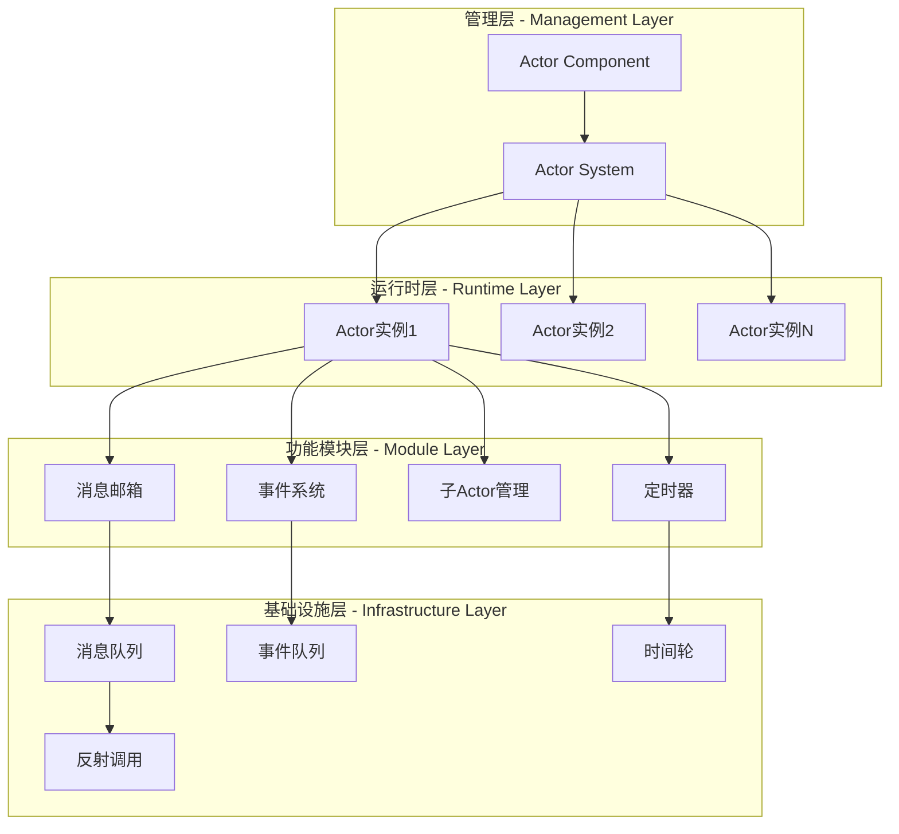

### 3.2 Actor消息处理流程

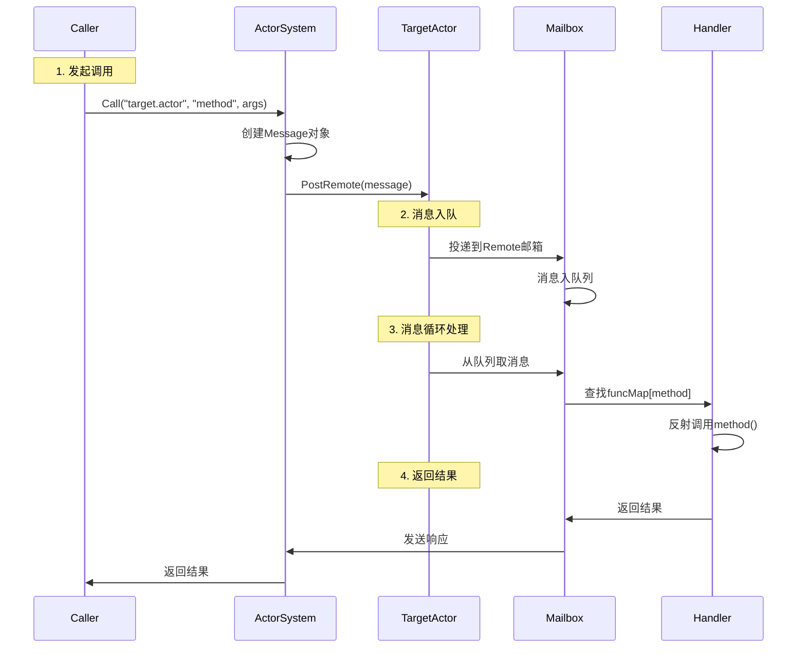

### 3.3 Actor内存关系

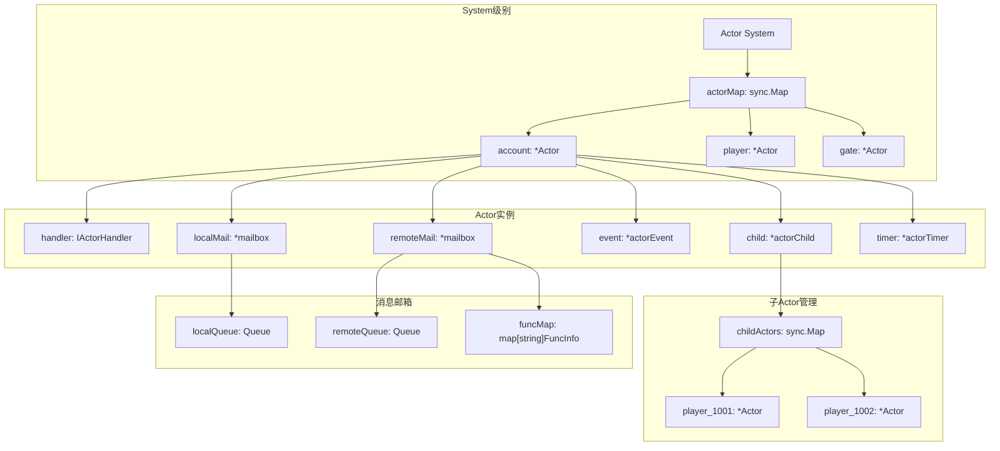

#### .内存分配层次结构
```mermaid
System (Actor系统管理器)
├── actorMap: sync.Map                    // 存储所有顶级Actor
│   ├── "account": *Actor                 // 账户管理Actor
│   ├── "player": *Actor                  // 玩家管理Actor  
│   └── "gate": *Actor                    // 网关Actor
│
每个Actor实例包含:
├── system: *System                       // 指向系统管理器
├── path: *ActorPath                      // Actor路径信息
├── handler: IActorHandler                // 业务逻辑处理器(用户实现)
├── localMail: *mailbox                   // 本地消息邮箱
├── remoteMail: *mailbox                  // 远程消息邮箱
├── event: *actorEvent                    // 事件处理器
├── child: *actorChild                    // 子Actor管理器
└── timer: *actorTimer                    // 定时器管理器
```

### 3.4 actor组件关系

```mermaid
┌─────────────────────────────────────────────────────────────┐
│                    Application Layer                        │
│  ┌─────────────────┐  ┌─────────────────┐  ┌─────────────────┐│
│  │   Component     │  │     System      │  │   IActorHandler ││
│  │  (管理器层)      │  │   (系统层)       │  │   (业务层)       ││
│  └─────────────────┘  └─────────────────┘  └─────────────────┘│
└─────────────────────────────────────────────────────────────┘
                                │
┌─────────────────────────────────────────────────────────────┐
│                     Actor Runtime Layer                    │
│  ┌─────────────────┐  ┌─────────────────┐  ┌─────────────────┐│
│  │     Actor       │  │      Base       │  │   子组件们       ││
│  │   (运行时)       │  │   (基础类)       │  │  (功能模块)      ││
│  └─────────────────┘  └─────────────────┘  └─────────────────┘│
└─────────────────────────────────────────────────────────────┘
                                │
┌─────────────────────────────────────────────────────────────┐
│                   Infrastructure Layer                     │
│  ┌─────────────────┐  ┌─────────────────┐  ┌─────────────────┐│
│  │     Queue       │  │     Timer       │  │    Invoke       ││
│  │   (消息队列)     │  │   (定时器)       │  │   (反射调用)     ││
│  └─────────────────┘  └─────────────────┘  └─────────────────┘│
└─────────────────────────────────────────────────────────────┘
 ```
### 3.5 组件依赖关系图

```mermaid
                    ┌─────────────┐
                    │ Application │
                    └──────┬──────┘
                           │
                    ┌─────────────┐
                    │  Component  │ ◄─── 注册到Application
                    └──────┬──────┘
                           │
                    ┌─────────────┐
                    │   System    │ ◄─── 管理所有Actor
                    └──────┬──────┘
                           │
                    ┌─────────────┐
                    │    Actor    │ ◄─── 运行时实例
                    └──────┬──────┘
                           │
        ┌──────────────────┼──────────────────┐
        │                  │                  │
 ┌─────────────┐    ┌─────────────┐    ┌─────────────┐
 │   mailbox   │    │ actorEvent  │    │ actorChild  │
 │  (消息处理)   │    │  (事件系统)   │    │ (子Actor)   │
 └─────────────┘    └─────────────┘    └─────────────┘
        │                  │                  │
 ┌─────────────┐    ┌─────────────┐    ┌─────────────┐
 │    queue    │    │    queue    │    │ actorTimer  │
 │  (消息队列)   │    │  (事件队列)   │    │  (定时器)    │
 └─────────────┘    └─────────────┘    └─────────────┘
 ```

### 3.6 Actor创建与拆分策略

#### 顶级Actor创建场景
```go
// ✅ 适合创建顶级Actor的场景：
// 1. 功能模块管理器
system.CreateActor("account", &ActorAccount{})    // 账户管理
system.CreateActor("player", &ActorPlayers{})     // 玩家管理  
system.CreateActor("mail", &ActorMail{})          // 邮件系统

// 2. 服务入口Actor
system.CreateActor("gate", &ActorGate{})          // 网关服务
system.CreateActor("game", &ActorGame{})          // 游戏服务
```

#### 子Actor创建场景
```go
// ✅ 适合创建子Actor的场景：
// 1. 实例化的业务对象
parentActor.Child().Create("1001", &actorPlayer{}) // 具体玩家
parentActor.Child().Create("guild_1", &actorGuildInstance{}) // 具体公会

// 2. 会话相关的临时Actor
parentActor.Child().Create(sessionID, &actorSession{}) // 会话处理
```
#### Actor拆分原则
```mermaid
1. 按业务领域拆分
    // 不同业务领域使用不同的顶级Actor
    ├── ActorAccount     // 账户域
    ├── ActorPlayer      // 玩家域  
    ├── ActorMail        // 邮件域
    ├── ActorGuild       // 公会域
    └── ActorShop        // 商店域

2. 按数据访问模式拆分
    // 全局单例数据 -> 顶级Actor
    ActorRanking         // 排行榜(全局唯一)
    ActorServerConfig    // 服务器配置(全局唯一)

    // 用户实例数据 -> 子Actor  
    ActorPlayer/childID  // 每个玩家一个子Actor
    ActorGuild/guildID   // 每个公会一个子Actor

3. 按并发需求拆分
    // 高并发场景 -> 多个子Actor分散负载
    ActorPlayers {
        child_1001: actorPlayer,  // 玩家1001
        child_1002: actorPlayer,  // 玩家1002
        // ... 每个玩家独立处理，避免锁竞争
    }

    // 低并发场景 -> 单个顶级Actor
    ActorServerMaintenance  // 服务器维护(低频操作)

5. 实际应用示例分析

demo_cluster中的Actor架构
    // Center节点 - 后端服务Actor
    ├── ActorAccount          // 账户管理(顶级)
    │   └── 无子Actor         // 账户数据全局管理

    // Game节点 - 游戏逻辑Actor  
    ├── ActorPlayers          // 玩家管理器(顶级)
    │   ├── child_1001        // 玩家1001(子Actor)
    │   ├── child_1002        // 玩家1002(子Actor)
    │   └── ...               // 每个在线玩家一个子Actor

    // Gate节点 - 网关Actor
    ├── ActorGate             // 网关管理(顶级)
    │   ├── agent_session1    // 连接1的代理(子Actor)
    │   ├── agent_session2    // 连接2的代理(子Actor)
    │   └── ...               // 每个连接一个代理子Actor

```
### 3.7 actor注册流程

    app.AddActors(&account.ActorAccount{}, &ops.ActorOps{}) ↓
    AppBuilder.AddActors() 调用 actorSystem.Add() ↓
    Component.Add() 将actors添加到actorHandlers切片 ↓
    Component.OnAfterInit() 遍历actorHandlers ↓
    对每个actor调用 c.CreateActor(actor.AliasID(), actor) ↓
    System.CreateActor() 创建Actor实例并启动goroutine ↓
    newActor() 创建Actor，调用handler.OnInit() ↓
    ActorAccount.OnInit() 注册函数到Remote邮箱

---

## 4. 模块系统分析

### 4.1 组件生命周期

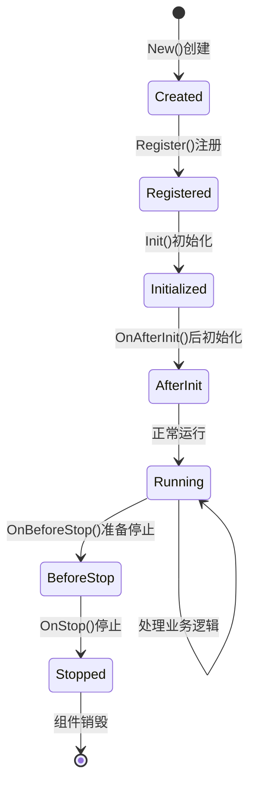

### 4.2 核心组件架构

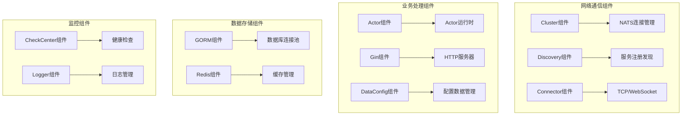

---

## 5. 通信机制详解

### 5.1 通信类型对比 （local和remote有点迷惑）

| 通信类型 | 范围 | 方式 | 调用模式 | 性能 | 适用场景 |
|---------|------|------|---------|------|---------|
| **Local** | 客户端调用的 |  NATS消息 | 使用actor | 中等 | 注册客户端调用的接口 |
| **Remote** | 跨节点 | NATS消息(rpc) | 使用actor | 中等 | 服务之间的调用 |

    remote： 是指不同节点的actor，直接调用 rpc
    // 内部RPC路由  
    Gate.AgentActor ──► NATS ──► Game.PlayerActor.Remote
                PublishRemote   PostRemote
    local： 是指客户端消息的路由，
    // 客户端消息路由
    客户端 ──► Gate.AgentActor ──► NATS ──► Game.PlayerActor.Local
       TCP连接           PublishLocal    PostLocal

### 5.2 消息路由流程

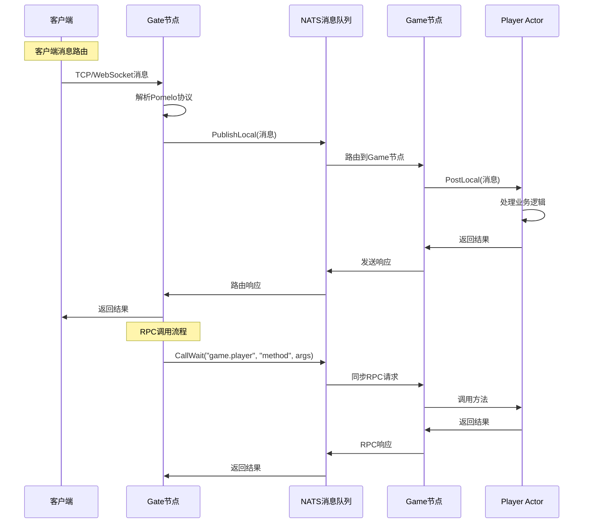

### 5.3 跨节点通信架构

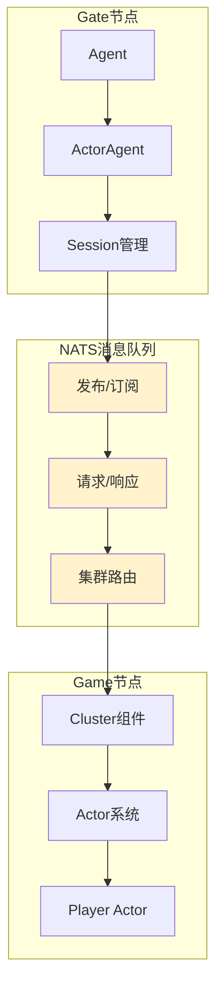

---

## 6. 服务发现与注册

### 6.1 nats完整的服务发现和调用流程(正式环境一般用etcd)

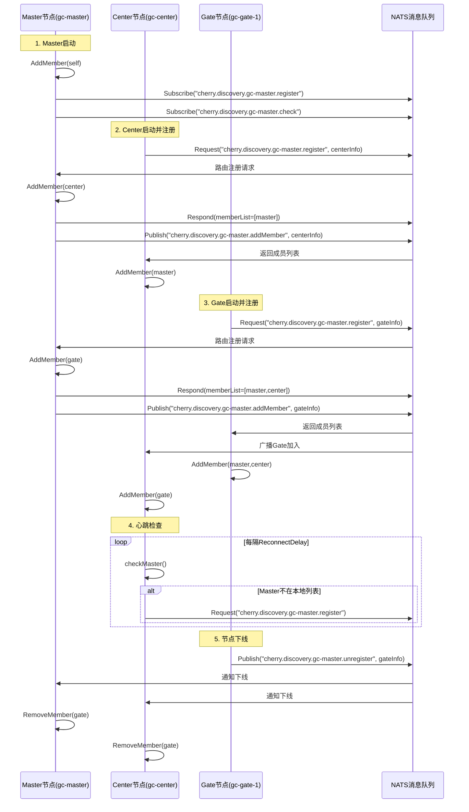

### 6.2 节点注册流程

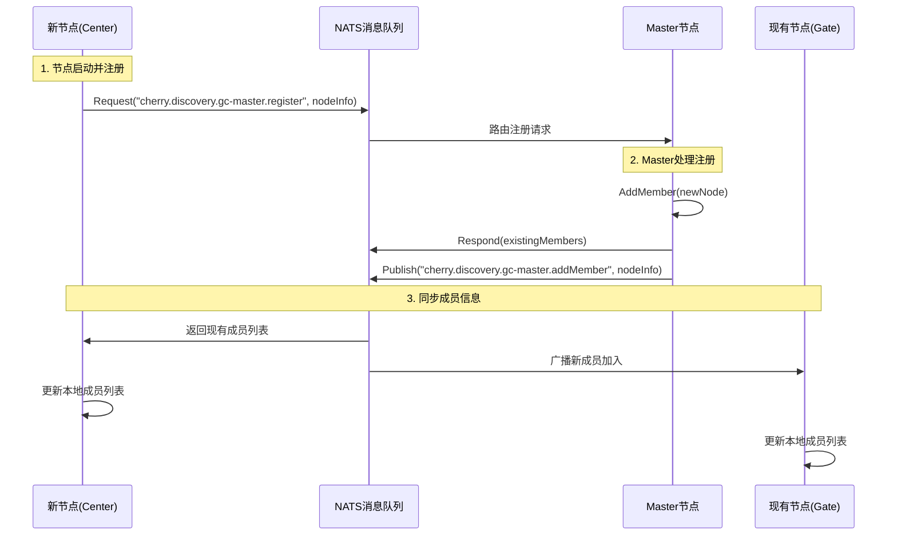

---

## 7. 错误处理与容错

### 7.1 节点崩溃检测机制

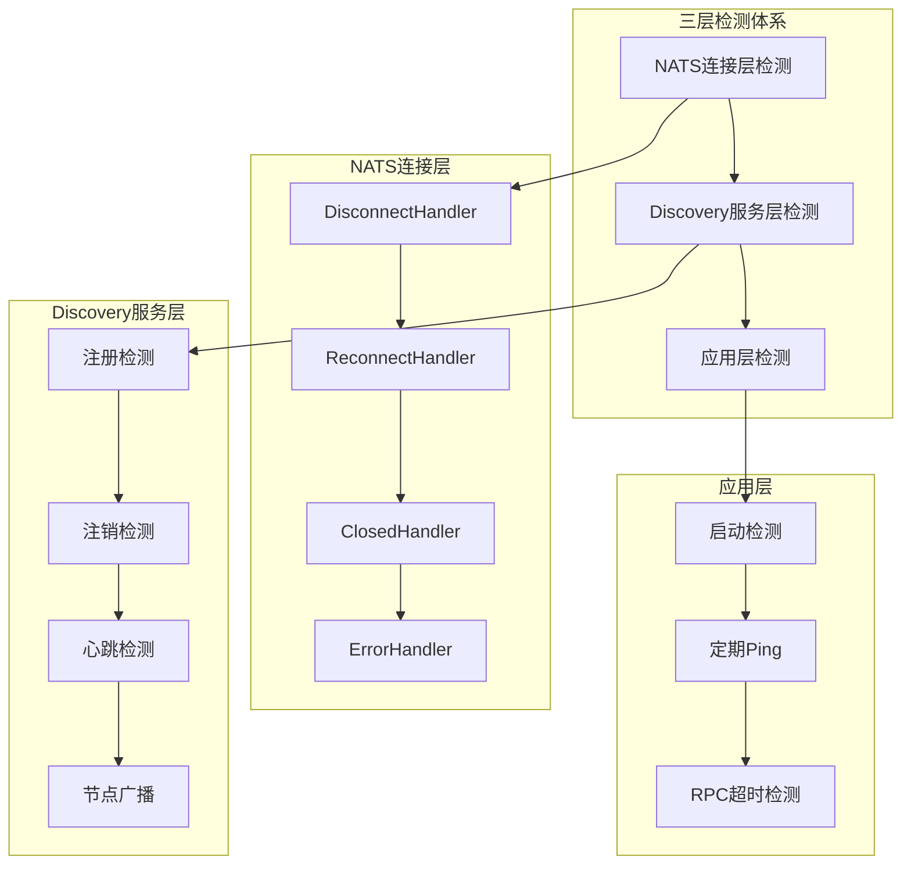

### 7.2 玩家重新路由流程

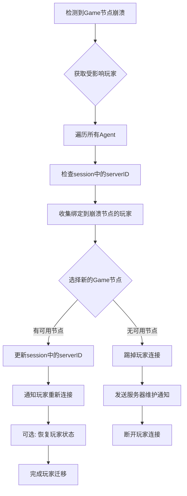

### 7.3 容错处理时序图

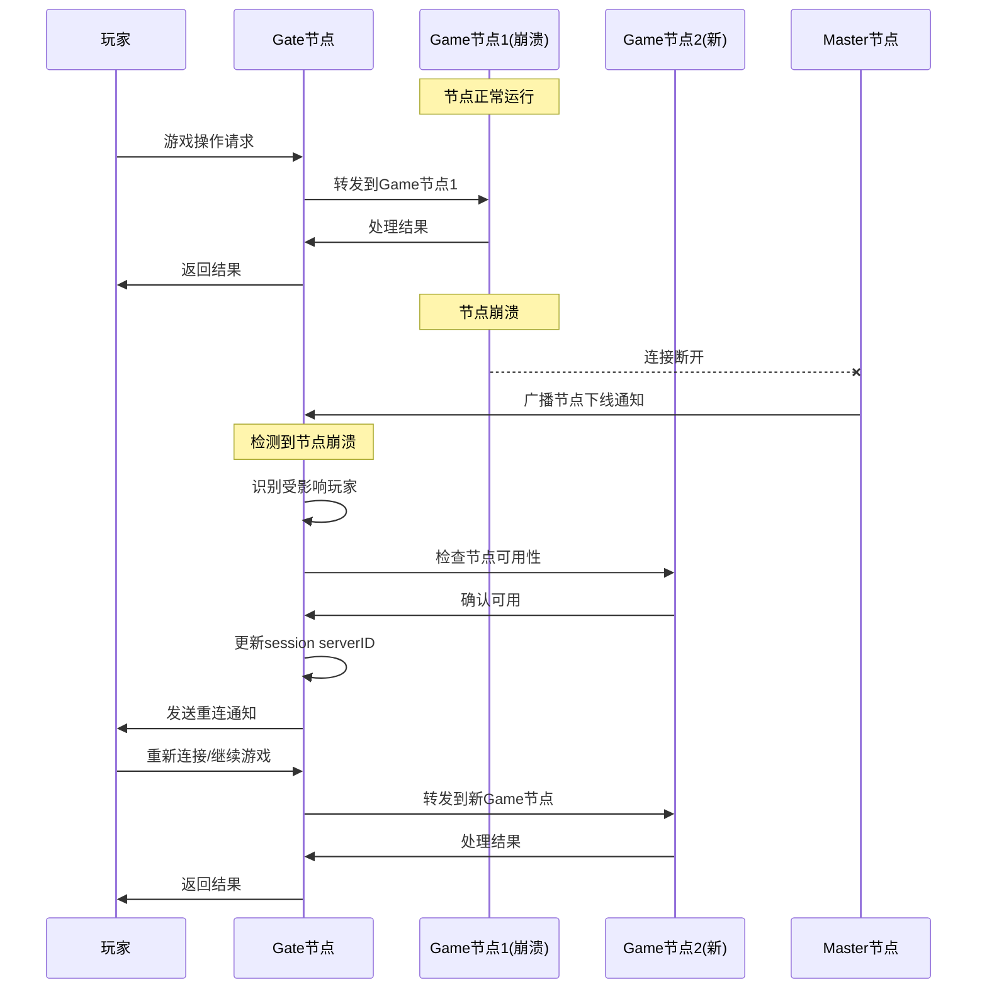

---

## 8. 最佳实践与应用场景

### 8.1 项目适用性分析

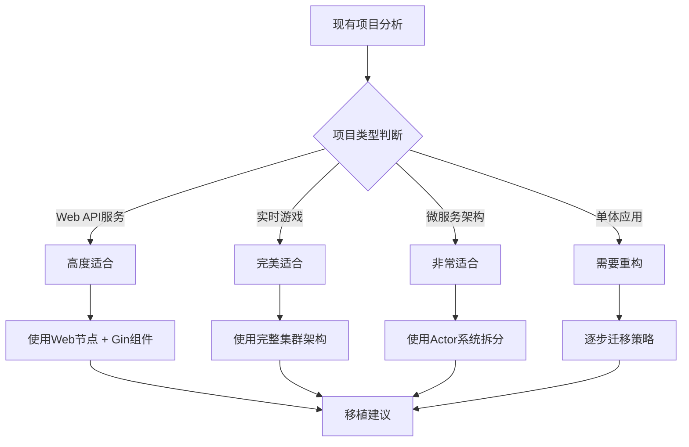

### 8.2 架构选择指南

| 应用场景 | 推荐架构 | 核心组件 | 优势 |
|---------|---------|---------|------|
| **Web API服务** | Web节点 + Center节点 | Gin + Actor + GORM | 快速开发、易于维护 |
| **实时游戏** | 完整集群架构 | Gate + Game + Center | 高并发、低延迟 |
| **微服务系统** | 多节点分布式 | Actor + Discovery + Cluster | 服务解耦、弹性扩展 |
| **数据处理** | Center节点 + 定时任务 | Actor + Timer + DataConfig | 批处理、定时任务 |

### 8.3 使用actor拆分设计

#### Actor设计优化
```go
// ✅ 推荐：按业务领域拆分Actor
├── ActorAccount     // 账户域
├── ActorPlayer      // 玩家域  
├── ActorMail        // 邮件域
└── ActorGuild       // 公会域

// ✅ 推荐：高并发场景使用子Actor
ActorPlayers {
    child_1001: actorPlayer,  // 玩家1001
    child_1002: actorPlayer,  // 玩家1002
    // 每个玩家独立处理，避免锁竞争
}
```

#### 通信优化
```go
// ✅ 推荐：同节点优先使用Local调用
if targetPath.NodeID == sourceActor.NodeID() {
    // 使用本地调用，性能最高
    system.PostLocal(message)
} else {
    // 跨节点使用Remote调用
    system.PostRemote(message)
}

// ✅ 推荐：批量操作使用RPC
result := system.CallWait("target.actor", "batchProcess", batchData)
```

### 8.4 部署架构示例

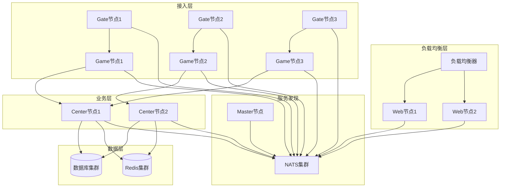

---

## 总结

Cherry框架是一个基于Actor模型的分布式游戏服务器框架，具有以下核心特点：

1. **Actor模型**：提供高并发、无锁的消息处理机制
2. **分布式架构**：支持多节点部署和弹性扩展
3. **服务发现**：自动化的节点注册和发现机制
4. **容错处理**：完善的错误检测和恢复机制
5. **组件化设计**：模块化的组件系统，易于扩展

该框架特别适合构建实时游戏、微服务系统和高并发Web应用，通过合理的架构设计和组件选择，可以快速构建稳定可靠的分布式系统。
---

## 
附录：详细流程图表

### A.1 Actor调用序列图

```mermaid
sequenceDiagram
    participant WebController as Web节点Controller
    participant WebActorSystem as Web节点ActorSystem
    participant NATS as NATS消息队列
    participant CenterCluster as Center节点Cluster
    participant CenterActorSystem as Center节点ActorSystem
    participant AccountActor as AccountActor
    
    WebController->>WebActorSystem: CallWait("center.account", "getUID", args)
    WebActorSystem->>NATS: PublishRemote("center", clusterPacket)
    NATS->>CenterCluster: 消息路由到center节点
    CenterCluster->>CenterActorSystem: PostRemote(message)
    CenterActorSystem->>AccountActor: 投递到account actor
    AccountActor->>AccountActor: processRemote() -> invokeFunc()
    Note over AccountActor: 反射调用getUID()方法
    AccountActor->>CenterActorSystem: 返回结果
    CenterActorSystem->>NATS: 发送响应
    NATS->>WebActorSystem: 路由响应回web节点
    WebActorSystem->>WebController: 返回UID
```

### A.2 NATS初始化流程详解

```mermaid
sequenceDiagram
    participant App as Application
    participant Cherry as Cherry.Configure
    participant ClusterComp as Cluster Component
    participant NATSCluster as NATS Cluster
    participant CNats as cnats Instance
    participant DiscoveryComp as Discovery Component
    participant DiscoveryNATS as Discovery NATS
    
    Note over App: 1. 应用启动
    App->>Cherry: cherry.Configure(...)
    Cherry->>Cherry: NewApp()
    
    Note over Cherry: 2. 集群模式检查
    Cherry->>ClusterComp: ccluster.New()
    ClusterComp->>NATSCluster: cherryNatsCluster.New(app)
    
    Note over NATSCluster: 3. NATS配置加载
    NATSCluster->>NATSCluster: loadConfig()
    NATSCluster->>CNats: cnats.NewFromConfig(natsConfig)
    NATSCluster->>CNats: cnats.SetInstance(natsConn)
    
    Note over Cherry: 4. 组件注册
    Cherry->>App: app.SetCluster(cluster)
    Cherry->>App: app.Register(cluster)
    Cherry->>DiscoveryComp: cdiscovery.New()
    Cherry->>App: app.Register(discovery)
    
    Note over App: 5. 应用启动
    App->>App: app.Startup()
    App->>ClusterComp: cluster.Init()
    ClusterComp->>CNats: cnats.Get().Connect()
    App->>DiscoveryComp: discovery.Init()
    DiscoveryComp->>DiscoveryNATS: Load(app)
    
    Note over DiscoveryNATS: 6. Discovery使用NATS
    DiscoveryNATS->>CNats: cnats.Get().Request(...)
    DiscoveryNATS->>CNats: cnats.Get().Subscribe(...)
```

### A.3 玩家注册登录流程

```mermaid
graph TB
    subgraph "Web节点 - 传统HTTP模式"
        HTTP[HTTP请求] --> GinController[Gin Controller]
        GinController --> RPC[RPC调用函数]
        RPC --> ActorSystem[Actor系统调用]
    end
    
    subgraph "Center节点 - Actor模式"
        ActorSystem --> NATS[NATS消息队列]
        NATS --> CenterActor[Center Actor]
        CenterActor --> Database[数据库操作]
    end
    
    subgraph "Gate节点 - Actor模式"
        ClientConn[客户端连接] --> GateActor[Gate Actor]
        GateActor --> GameActor[Game Actor]
    end
```

### A.4 Actor本地阻塞调用流程

```mermaid
sequenceDiagram
    participant Caller as 调用方(Web Controller)
    participant ActorSystem as Actor系统
    participant TargetActor as 目标Actor(Center.Account)
    participant Channel as ChanResult通道
    
    Note over Caller: 1. 发起CallWait调用
    Caller->>ActorSystem: CallWait("center.account", "getUID", args)
    ActorSystem->>ActorSystem: 创建Message和Channel
    ActorSystem->>TargetActor: PostRemote(message)
    
    Note over ActorSystem: 2. 阻塞等待响应
    ActorSystem->>Channel: result = <-message.ChanResult (阻塞)
    
    Note over TargetActor: 3. 目标Actor处理消息
    TargetActor->>TargetActor: processRemote()
    TargetActor->>TargetActor: invokeFunc("getUID")
    TargetActor->>TargetActor: 执行getUID()方法
    
    Note over TargetActor: 4. 发送响应
    TargetActor->>Channel: message.ChanResult <- response
    
    Note over ActorSystem: 5. 解除阻塞
    Channel->>ActorSystem: 返回response
    ActorSystem->>Caller: 返回结果
```

### A.5 Agent系统架构

```mermaid
graph TB
    subgraph "客户端层"
        A[游戏客户端1] --> D[TCP/WebSocket连接1]
        B[游戏客户端2] --> E[TCP/WebSocket连接2]  
        C[游戏客户端3] --> F[TCP/WebSocket连接3]
    end
    
    subgraph "Gate节点 - Agent层"
        D --> G[Agent1]
        E --> H[Agent2]
        F --> I[Agent3]
    end
    
    subgraph "业务Actor层"
        G --> J[ActorAgent1]
        H --> K[ActorAgent2]
        I --> L[ActorAgent3]
    end
    
    subgraph "Game节点"
        J --> M[Player Actor1]
        K --> N[Player Actor2]
        L --> O[Player Actor3]
    end
```

### A.6 Agent生命周期状态图

```mermaid
stateDiagram-v2
    [*] --> AgentInit: 客户端连接
    AgentInit --> AgentWaitAck: 等待握手确认
    AgentWaitAck --> AgentWorking: 握手成功
    AgentWorking --> AgentClosed: 连接断开
    AgentClosed --> [*]: 清理资源
    
    AgentWorking --> AgentWorking: 处理消息
    AgentInit --> AgentClosed: 连接失败
    AgentWaitAck --> AgentClosed: 握手超时
```

### A.7 配置系统架构

```mermaid
flowchart TD
    A["任意Go数据类型"] --> B["Wrap函数"]
    B --> C["Config对象"]
    C --> D["统一的配置访问接口"]

    E["JSON字符串"] --> B
    F["map[string]interface{}"] --> B
    G["struct结构体"] --> B
    H["slice切片"] --> B
```

### A.8 NodeID管理系统

```mermaid
graph TB
    subgraph "Cherry集群"
        A[Master节点<br/>gc-master-1] --> B[Discovery服务]
        C[Gate节点<br/>gc-gate-1] --> B
        D[Game节点<br/>gc-game-1] --> B
        E[Game节点<br/>gc-game-2] --> B
        F[Center节点<br/>gc-center-1] --> B
    end
    
    B --> G[节点注册表<br/>NodeID -> Member]
```

---

## 学习记录与FAQ

### 常见问题解答

**Q1: gRPC和NATS-Server怎么使用的？**

A: Cherry框架主要使用NATS作为消息中间件，而不是gRPC。NATS提供发布/订阅和请求/响应模式，用于节点间通信和服务发现。gRPC可以作为补充，但不是核心通信机制。

**Q2: 登录和注册是否使用Actor模型？**

A: 部分使用。Web节点采用传统HTTP服务模式（Gin + Controller），通过RPC调用Center节点的Actor来处理实际业务逻辑。这种混合架构既保持了Web服务的简单性，又利用了Actor的状态管理能力。

**Q3: Gateway层如何连接多个Game层？**

A: 通过用户绑定机制。每个用户在session中绑定到特定的Game节点（serverID），Gate节点通过NATS将消息路由到对应的Game节点。支持动态负载均衡和故障转移。

**Q4: 同节点和跨节点通信的区别？**

A: 
- **同节点**：直接通过内存队列和反射机制调用，性能最高
- **跨节点**：通过NATS消息队列，支持异步消息和同步RPC两种模式

**Q5: 如果Game节点崩溃，绑定的用户如何处理？**

A: 框架提供三层检测机制：
1. NATS连接层检测
2. Discovery服务层检测  
3. 应用层检测

检测到崩溃后，Gate节点会重新为受影响的玩家选择可用的Game节点，并可选择性地恢复玩家状态。

**Q6: Remote和Local的区别？**

A: 
- **Remote**：跨节点Actor调用，通过NATS消息队列
- **Local**：客户端消息路由，从Gate节点路由到Game节点的Player Actor

### 技术要点总结

1. **Actor模型优势**：无锁并发、消息驱动、状态隔离
2. **NATS消息队列**：高性能、支持集群、自动故障转移
3. **组件化设计**：生命周期管理、依赖注入、易于扩展
4. **服务发现**：自动注册、健康检查、动态路由
5. **容错机制**：多层检测、自动恢复、优雅降级

总结：为什么需要独立的 Actor goroutine
你说得对，不同玩家之间确实不会互相阻塞。

但需要独立 Actor goroutine 的真正原因是：

解耦网络 I/O 和业务逻辑

Agent.readChan() 专注读取网络数据
Actor.run() 专注处理业务逻辑
业务逻辑慢不会阻塞网络读取
保证同一玩家的消息串行处理

避免状态竞态（login 和 enterGame 并发）
保证消息顺序（先 login 后 enterGame）
消息缓冲（mailbox）

客户端突发流量时，消息先缓存
Actor 按自己的节奏处理
Actor 模型的标准实现

每个 Actor 独立运行
通过消息队列通信
内部状态串行修改

这个架构文档涵盖了Cherry框架的核心概念和实现细节，可以作为学习和开发的参考指南。