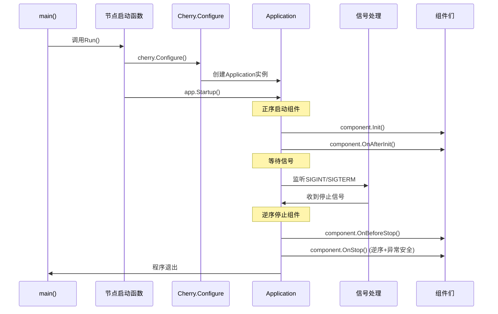

### &#x20;cherry game farm

使用demo\_cluster 来讲解

#### 服务启动和停止链路

```mermaid
sequenceDiagram
    participant Main as main()
    participant Node as 节点启动函数
    participant Cherry as Cherry.Configure
    participant App as Application
    participant Signal as 信号处理
    participant Components as 组件们
    
    Main->>Node: 调用Run()
    Node->>Cherry: cherry.Configure()
    Cherry->>App: 创建Application实例
    Node->>App: app.Startup()
    
    Note over App: 正序启动组件
    App->>Components: component.Init()
    App->>Components: component.OnAfterInit()
    
    Note over App: 等待信号
    App->>Signal: 监听SIGINT/SIGTERM
    Signal->>App: 收到停止信号
    
    Note over App: 逆序停止组件
    App->>Components: component.OnBeforeStop()
    App->>Components: component.OnStop() (逆序+异常安全)
    
    App->>Main: 程序退出

```

