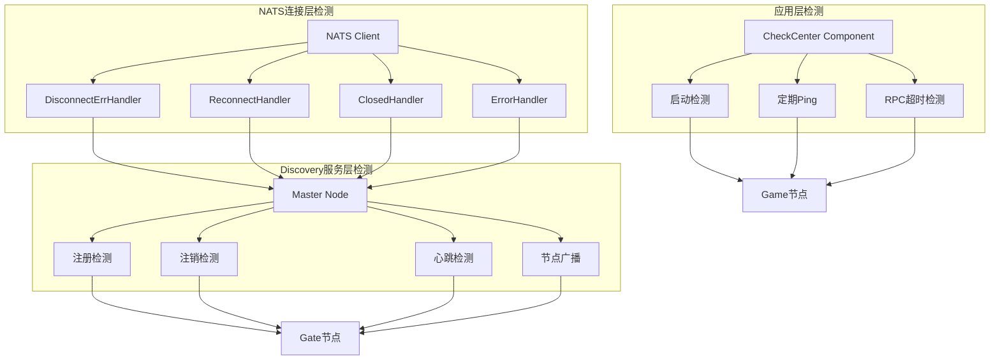
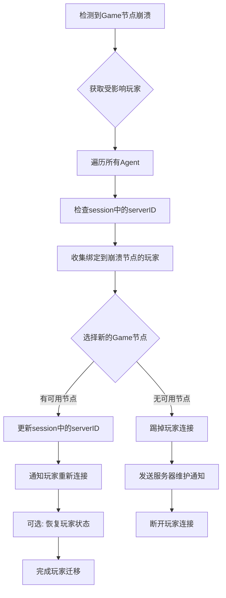
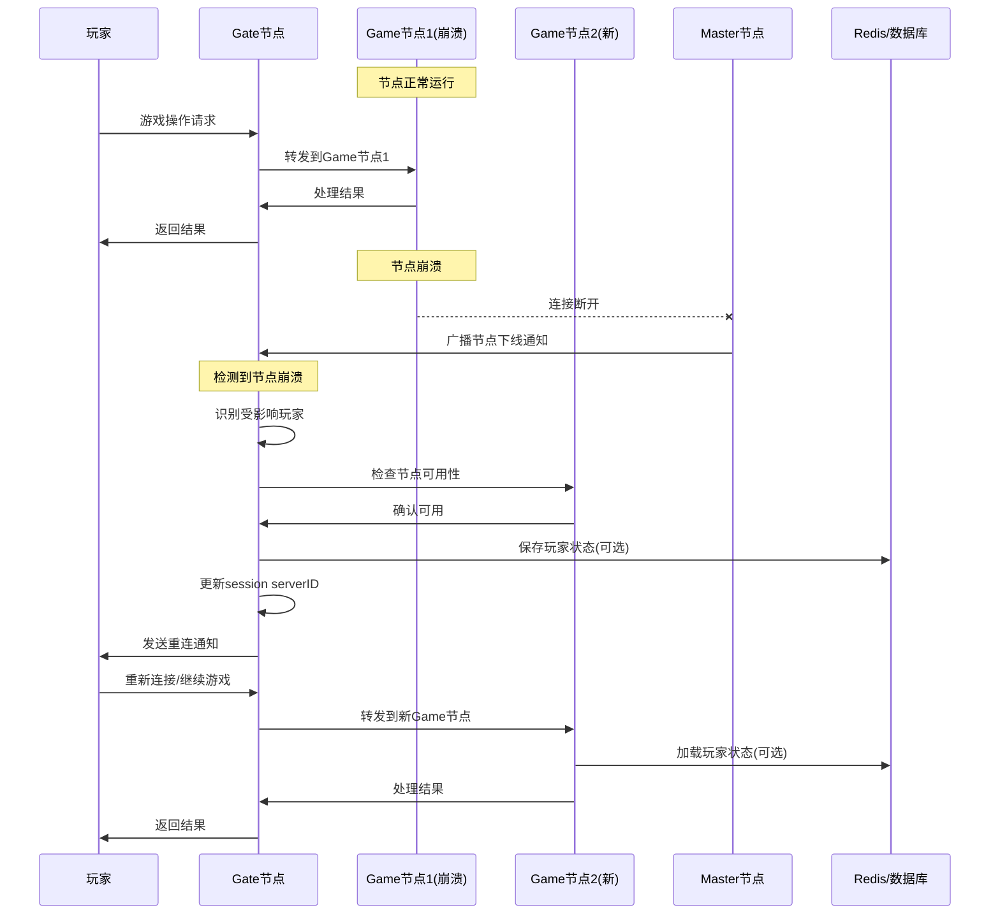
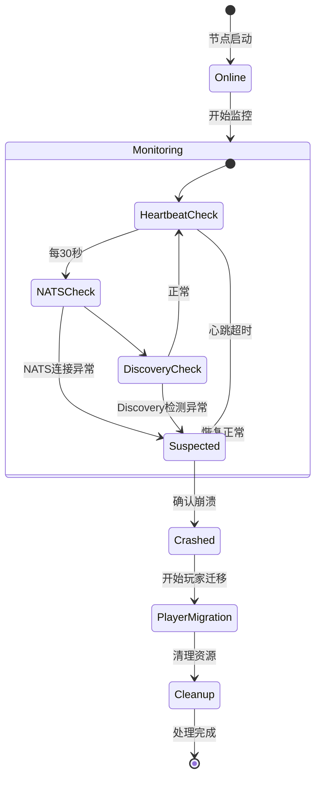
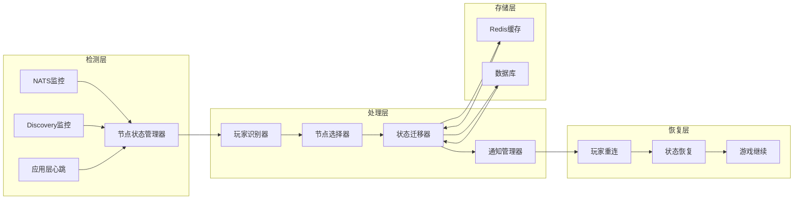
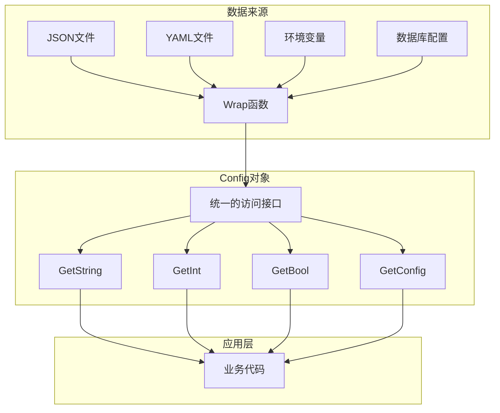
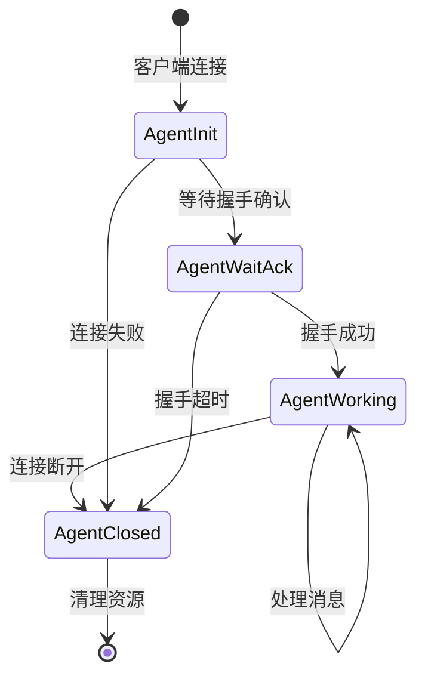
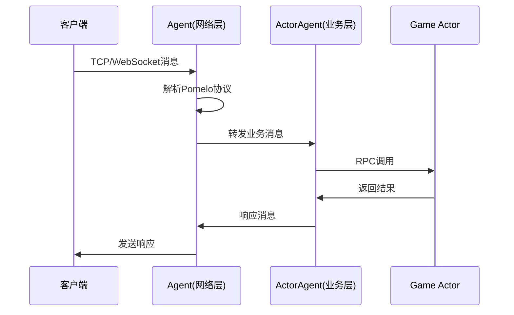
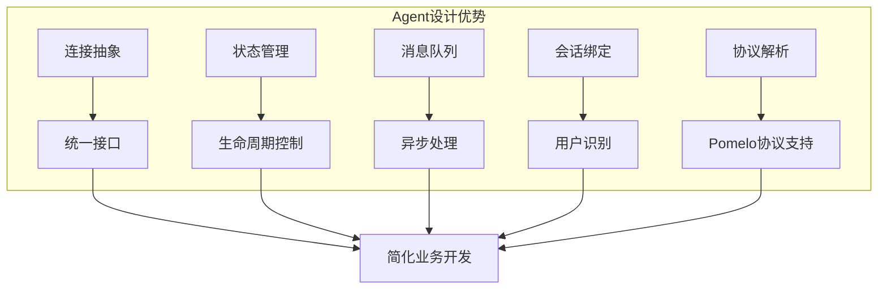

```mermaid
graph LR
    subgraph "检测层"
        A[NATS监控] --> D[节点状态管理器]
        B[Discovery监控] --> D
        C[应用层心跳] --> D
    end
    
    subgraph "处理层"
        D --> E[玩家识别器]
        E --> F[节点选择器]
        F --> G[状态迁移器]
        G --> H[通知管理器]
    end
    
    subgraph "恢复层"
        H --> I[玩家重连]
        I --> J[状态恢复]
        J --> K[游戏继续]
    end
    
    subgraph "存储层"
        L[Redis缓存] --> G
        M[数据库] --> G
        G --> L
        G --> M
    end
```#
 Cherry框架 Mermaid 图表集合

## 节点崩溃检测与处理流程

### 1. 节点崩溃检测序列图
*创建时间: 2025-01-27*
*描述: 展示从Game节点崩溃到Gate节点检测并处理的完整时序*

```mermaid
sequenceDiagram
    participant Client as 客户端
    participant Gate as Gate节点
    participant Game as Game节点
    participant NATS as NATS服务器
    participant Master as Master节点
    participant Discovery as Discovery服务

    Note over Game: Game节点正常运行
    Client->>Gate: 发送游戏消息
    Gate->>Game: 转发消息到Game节点
    Game->>Gate: 返回响应
    Gate->>Client: 转发响应

    Note over Game: Game节点崩溃
    Game--xNATS: 连接断开
    NATS->>Master: DisconnectHandler触发
    Master->>Discovery: 检测到节点离线
    Discovery->>Gate: 广播节点下线通知
    
    Client->>Gate: 继续发送消息
    Gate->>Game: 尝试转发消息
    Note over Gate: 消息发送失败
    Gate->>Client: 返回错误或重新路由
```

### 2. 节点检测机制架构图
*创建时间: 2025-01-27*
*描述: 三层检测体系的架构关系*



### 3. 玩家重新路由流程图
*创建时间: 2025-01-27*
*描述: 检测到节点崩溃后的玩家处理流程*



### 4. 完整的崩溃处理时序图
*创建时间: 2025-01-27*
*描述: 包含玩家状态恢复的完整处理流程*



### 5. 节点状态监控流程图
*创建时间: 2025-01-27*
*描述: 节点状态变化的状态机*



### 6. 改进后的错误处理架构图
*创建时间: 2025-01-27*
*描述: 完整的错误处理系统架构*



---

*注意: 以上图表展示了Cherry框架中节点崩溃检测和处理的完整机制，可用于系统设计和故障排查参考。*

```mermaid
flowchart TD
    A[现有项目分析] --> B{项目类型判断}
    B -->|Web API服务| C[高度适合]
    B -->|实时游戏| D[完美适合]
    B -->|微服务架构| E[非常适合]
    B -->|单体应用| F[需要重构]
    
    C --> G[使用Web节点 + Gin组件]
    D --> H[使用完整集群架构]
    E --> I[使用Actor系统拆分]
    F --> J[逐步迁移策略]
    
    G --> K[移植建议]
    H --> K
    I --> K
    J --> K
```#
# Cherry框架配置系统

### 1. Config结构和Wrap函数关系图
*创建时间: 2025-01-27*
*描述: 展示Config结构如何通过Wrap函数统一不同数据源的访问*

```mermaid
flowchart TD
    A[任意Go数据类型] --> B[Wrap函数]
    B --> C[Config对象]
    C --> D[统一的配置访问接口]
    
    E[JSON字符串] --> B
    F[map[string]interface{}] --> B
    G[struct结构体] --> B
    H[slice切片] --> B
```

### 2. 配置数据流转架构
*创建时间: 2025-01-27*
*描述: 从配置文件到应用组件的完整数据流*



### 3. 配置加载时序图
*创建时间: 2025-01-27*
*描述: Cherry框架中配置加载和使用的完整时序*

```mermaid
sequenceDiagram
    participant App as 应用启动
    participant Profile as Profile模块
    participant Config as Config对象
    participant Component as 组件

    App->>Profile: loadFile("config.json")
    Profile->>Profile: 读取JSON文件
    Profile->>Config: Wrap(jsonData)
    Config->>App: 返回Config对象
    
    App->>Component: 初始化组件
    Component->>Config: GetConfig("nats")
    Config->>Component: 返回NATS配置
    Component->>Component: 创建NATS连接
```#
# Cherry框架Agent系统

### 1. Agent架构层次图
*创建时间: 2025-01-27*
*描述: Agent在Cherry框架中的层次结构和职责分工*

```mermaid
graph TB
    subgraph "客户端层"
        A[游戏客户端1] --> D[TCP/WebSocket连接1]
        B[游戏客户端2] --> E[TCP/WebSocket连接2]  
        C[游戏客户端3] --> F[TCP/WebSocket连接3]
    end
    
    subgraph "Gate节点 - Agent层"
        D --> G[Agent1]
        E --> H[Agent2]
        F --> I[Agent3]
    end
    
    subgraph "业务Actor层"
        G --> J[ActorAgent1]
        H --> K[ActorAgent2]
        I --> L[ActorAgent3]
    end
    
    subgraph "Game节点"
        J --> M[Player Actor1]
        K --> N[Player Actor2]
        L --> O[Player Actor3]
    end
```

### 2. Agent生命周期状态图
*创建时间: 2025-01-27*
*描述: Agent从创建到销毁的完整生命周期*



### 3. Agent消息处理时序图
*创建时间: 2025-01-27*
*描述: 从客户端消息到业务处理的完整流程*



### 4. Agent设计优势图
*创建时间: 2025-01-27*
*描述: Agent设计带来的核心优势和价值*

