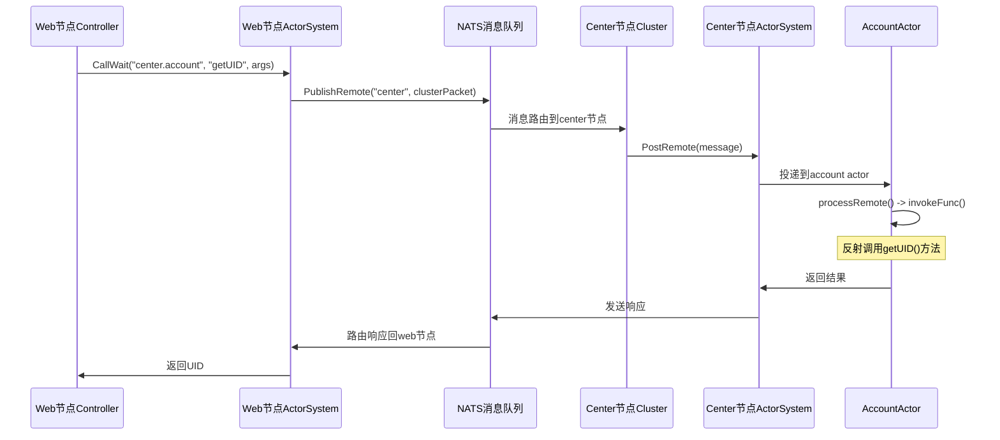
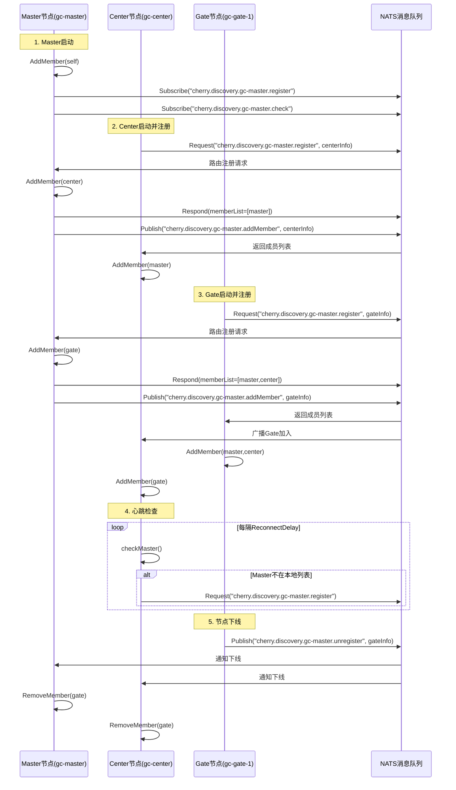
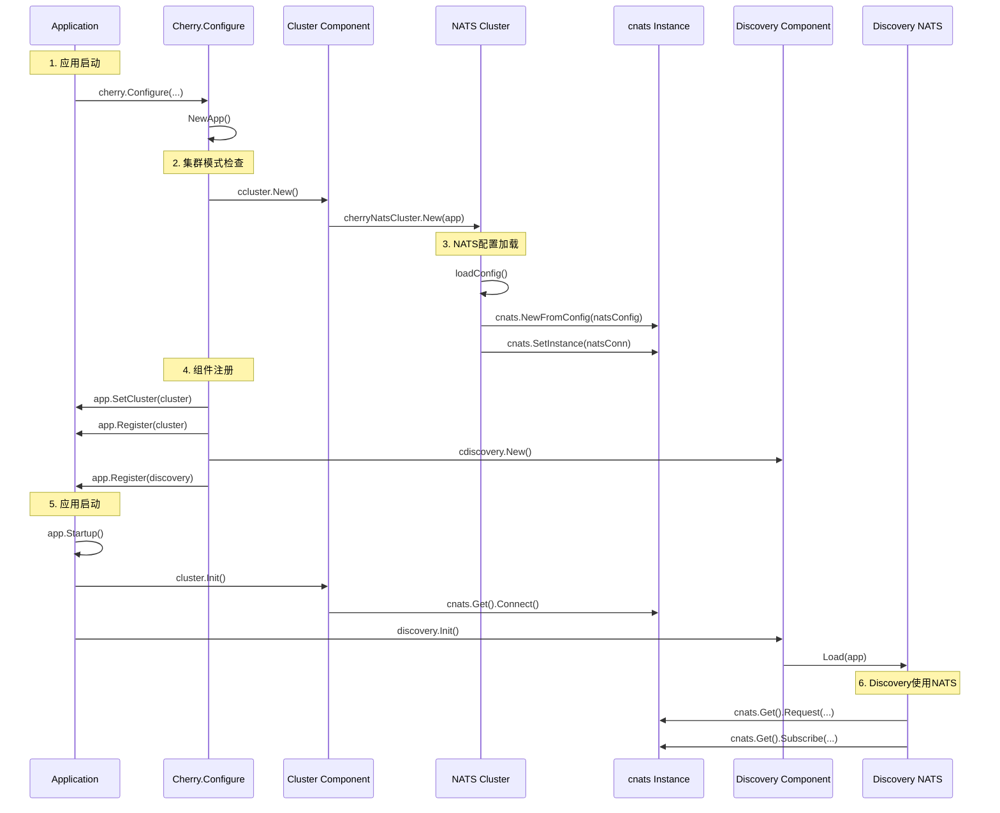
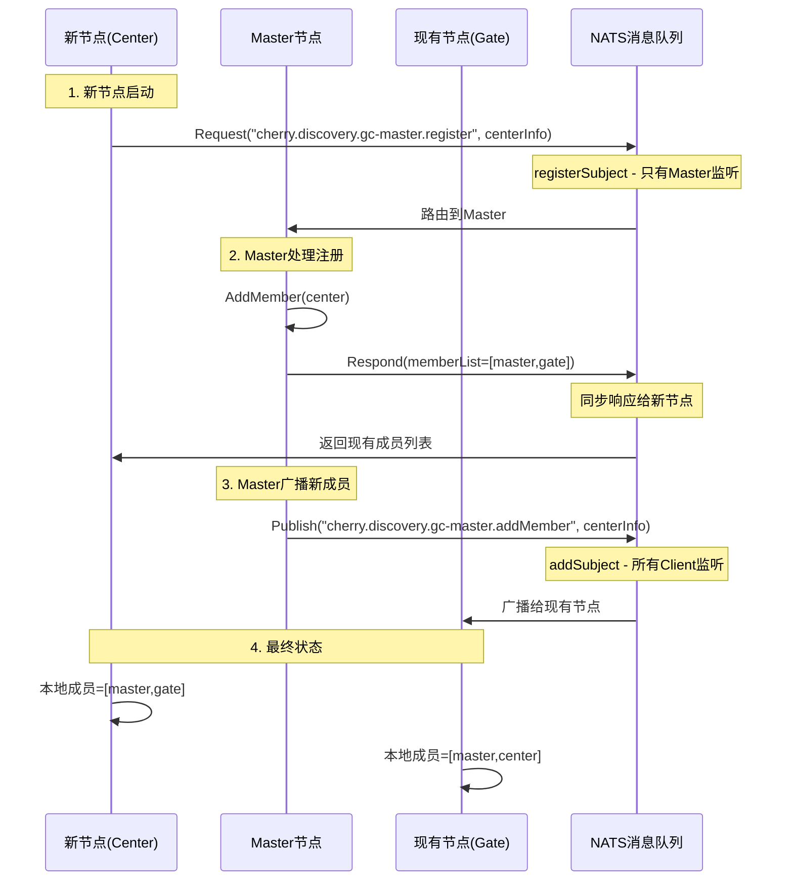
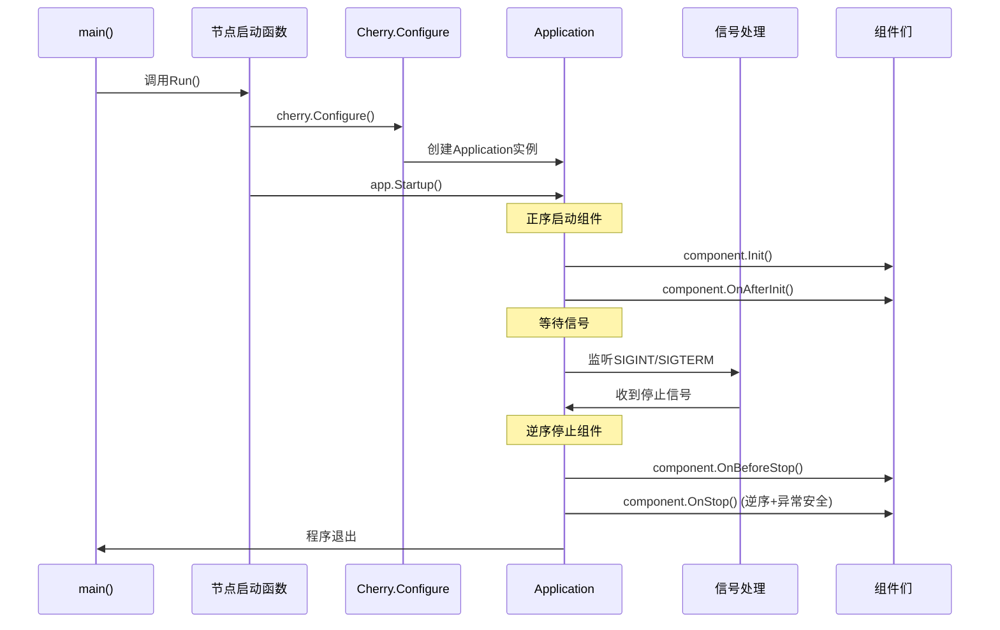
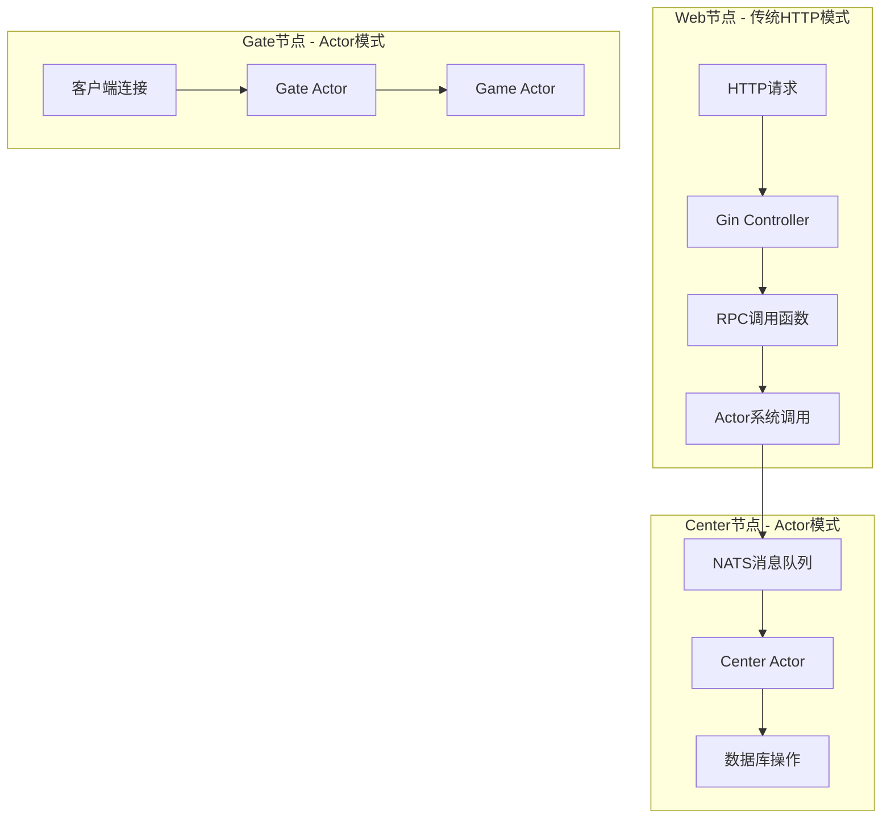
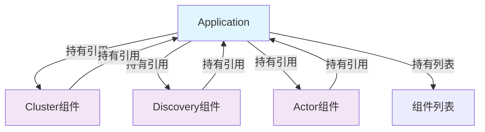
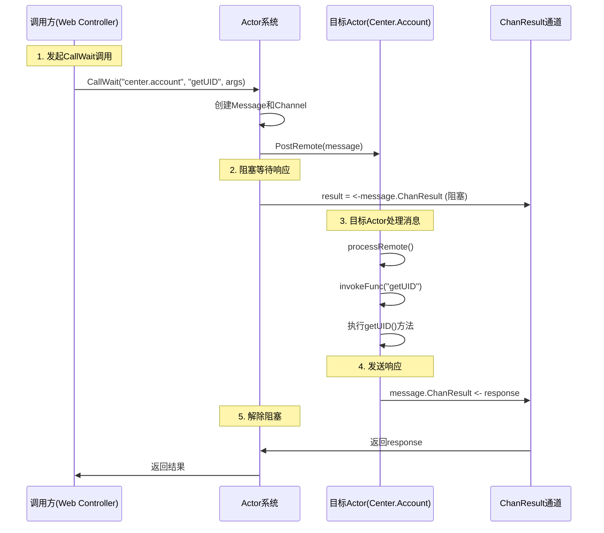

#### actor调用序列图

#### actor注册流程
1. app.AddActors(&account.ActorAccount{}, &ops.ActorOps{})
   ↓
2. AppBuilder.AddActors() 调用 actorSystem.Add()
   ↓  
3. Component.Add() 将actors添加到actorHandlers切片
   ↓
4. Component.OnAfterInit() 遍历actorHandlers
   ↓
5. 对每个actor调用 c.CreateActor(actor.AliasID(), actor)
   ↓
6. System.CreateActor() 创建Actor实例并启动goroutine
   ↓
7. newActor() 创建Actor，调用handler.OnInit()
   ↓
8. ActorAccount.OnInit() 注册函数到Remote邮箱


#### 完整的服务发现和调用流程


#### NATS (cnats) 初始化流程详解


#### 服务注册和服务发现流程


#### 服务启动和停止链路


#### 玩家注册，登陆流程


#### app和component依赖关系 （他们之间没有循环依赖，应该创建的时候，不需要任何依赖，是创建之后再建立依赖关系的）
##### 使用方式 A. 分离创建和初始化 B. 使用接口和延迟绑定
    A. 分离创建和初始化
    // 创建阶段：不需要任何依赖
    cluster := ccluster.New()
    discovery := cdiscovery.New()

    // 注入阶段：建立依赖关系
    cluster.Set(app)
    discovery.Set(app)

    // 初始化阶段：使用依赖进行初始化
    cluster.Init()
    discovery.Init()

    B. 使用接口和延迟绑定
    type Component struct {
    app IApplication  // 接口类型，支持延迟绑定
    }
    func (c *Component) Set(app IApplication) {
        c.app = app  // 运行时绑定
    }
    func (c *Component) SomeMethod() {
        if c.app != nil {  // 检查是否已注入
            cluster := c.app.Cluster()
            // 使用其他组件
        }
    }



#### actor调用本地阻塞的完整流程

#### actor组件关系

```mermaid
┌─────────────────────────────────────────────────────────────┐
│                    Application Layer                        │
│  ┌─────────────────┐  ┌─────────────────┐  ┌─────────────────┐│
│  │   Component     │  │     System      │  │   IActorHandler ││
│  │  (管理器层)      │  │   (系统层)       │  │   (业务层)       ││
│  └─────────────────┘  └─────────────────┘  └─────────────────┘│
└─────────────────────────────────────────────────────────────┘
                                │
┌─────────────────────────────────────────────────────────────┐
│                     Actor Runtime Layer                    │
│  ┌─────────────────┐  ┌─────────────────┐  ┌─────────────────┐│
│  │     Actor       │  │      Base       │  │   子组件们       ││
│  │   (运行时)       │  │   (基础类)       │  │  (功能模块)      ││
│  └─────────────────┘  └─────────────────┘  └─────────────────┘│
└─────────────────────────────────────────────────────────────┘
                                │
┌─────────────────────────────────────────────────────────────┐
│                   Infrastructure Layer                     │
│  ┌─────────────────┐  ┌─────────────────┐  ┌─────────────────┐│
│  │     Queue       │  │     Timer       │  │    Invoke       ││
│  │   (消息队列)     │  │   (定时器)       │  │   (反射调用)     ││
│  └─────────────────┘  └─────────────────┘  └─────────────────┘│
└─────────────────────────────────────────────────────────────┘
 ```

 ```mermaid
 组件依赖关系图
                    ┌─────────────┐
                    │ Application │
                    └──────┬──────┘
                           │
                    ┌─────────────┐
                    │  Component  │ ◄─── 注册到Application
                    └──────┬──────┘
                           │
                    ┌─────────────┐
                    │   System    │ ◄─── 管理所有Actor
                    └──────┬──────┘
                           │
                    ┌─────────────┐
                    │    Actor    │ ◄─── 运行时实例
                    └──────┬──────┘
                           │
        ┌──────────────────┼──────────────────┐
        │                  │                  │
 ┌─────────────┐    ┌─────────────┐    ┌─────────────┐
 │   mailbox   │    │ actorEvent  │    │ actorChild  │
 │  (消息处理)   │    │  (事件系统)   │    │ (子Actor)   │
 └─────────────┘    └─────────────┘    └─────────────┘
        │                  │                  │
 ┌─────────────┐    ┌─────────────┐    ┌─────────────┐
 │    queue    │    │    queue    │    │ actorTimer  │
 │  (消息队列)   │    │  (事件队列)   │    │  (定时器)    │
 └─────────────┘    └─────────────┘    └─────────────┘
 ```
 消息流转关系


 ```mermaid
 // 消息处理流程
Client ──► Gate ──► NATS ──► Game ──► Actor
                                      │
                              ┌───────┼───────┐
                              │       │       │
                        ┌─────────┐ ┌─────────┐ ┌─────────┐
                        │ Local   │ │ Remote  │ │ Event   │
                        │MailBox  │ │MailBox  │ │ Queue   │
                        └─────────┘ └─────────┘ └─────────┘
                              │       │       │
                        ┌─────────┐ ┌─────────┐ ┌─────────┐
                        │ Local   │ │ Remote  │ │ Event   │
                        │ Queue   │ │ Queue   │ │Handler  │
                        └─────────┘ └─────────┘ └─────────┘
                              │       │       │
                        ┌─────────────────────────────┐
                        │      Actor.loop()           │
                        │    (消息循环处理)             │
                        └─────────────────────────────┘
```

5. 各组件的职责分工
管理层
Component: Actor系统的应用组件，负责生命周期管理
System: Actor系统核心，管理所有Actor实例和全局配置
运行时层
Actor: Actor运行时实例，每个独立的goroutine
Base: Actor基础类，提供默认实现和通用功能
功能模块层
mailbox: 消息邮箱，管理Local/Remote消息队列和函数注册
actorEvent: 事件系统，支持发布/订阅模式
actorChild: 子Actor管理，支持层次化Actor结构
actorTimer: 定时器管理，支持各种定时任务
基础设施层
queue: 无锁消息队列，高性能消息存储
invoke: 反射调用机制，动态函数调用
timer: 全局时间轮，高效定时器实现

```

#### Actor创建时的内存关系

```mermaid

1.内存分配层次结构
System (Actor系统管理器)
├── actorMap: sync.Map                    // 存储所有顶级Actor
│   ├── "account": *Actor                 // 账户管理Actor
│   ├── "player": *Actor                  // 玩家管理Actor  
│   └── "gate": *Actor                    // 网关Actor
│
每个Actor实例包含:
├── system: *System                       // 指向系统管理器
├── path: *ActorPath                      // Actor路径信息
├── handler: IActorHandler                // 业务逻辑处理器(用户实现)
├── localMail: *mailbox                   // 本地消息邮箱
├── remoteMail: *mailbox                  // 远程消息邮箱
├── event: *actorEvent                    // 事件处理器
├── child: *actorChild                    // 子Actor管理器
└── timer: *actorTimer                    // 定时器管理器

内存引用关系

    // 1. 用户Handler与Actor的双向引用
    type actor struct {
        cherryActor.Base  // 组合Base，Base.Actor指向运行时Actor
    }

    // 2. 创建时的内存绑定
    func newActor(actorID, childID string, handler IActorHandler, c *System) (*Actor, error) {
        thisActor := Actor{
            handler: handler,  // Actor持有handler引用
            // ... 其他字段
        }
        
        // 如果handler实现了IActorLoader接口
        if actorLoad, ok := handler.(IActorLoader); ok {
            actorLoad.load(&thisActor)  // handler的Base.Actor指向thisActor
        }
    }
2. Actor相互调用机制

    本地调用流程
    // 1. 发起调用
    parentActor.Call(targetPath, funcName, args)
        ↓
    // 2. System路由消息
    system.Call(sourcePath, targetPath, funcName, args)
        ↓
    // 3. 创建Message并投递
    message := Message{
        Source: sourcePath,
        Target: targetPath, 
        FuncName: funcName,
        Args: args,
    }
    system.PostRemote(&message)
        ↓
    // 4. 目标Actor接收消息
    targetActor.PostRemote(&message)  // 投递到remoteMail
        ↓
    // 5. Actor消息循环处理
    targetActor.processRemote()
        ↓
    // 6. 从邮箱funcMap查找函数并调用
    funcInfo := remoteMail.funcMap[funcName]
    invokeFunc(funcInfo, message)
跨节点调用流程
    // 1. 判断是否跨节点
    if targetPath.NodeID != sourceActor.NodeID() {
        // 2. 序列化参数
        argsBytes := app.Serializer().Marshal(args)
        
        // 3. 构建集群消息包
        clusterPacket := ClusterPacket{
            SourcePath: sourcePath,
            TargetPath: targetPath,
            FuncName: funcName,
            ArgBytes: argsBytes,
        }
        
        // 4. 通过NATS发布到目标节点
        app.Cluster().PublishRemote(targetNodeID, clusterPacket)
    }
3. 子Actor的创建与管理

父子Actor内存关系

    ParentActor {
        child: &actorChild{
            thisActor: &ParentActor,           // 循环引用
            childActors: sync.Map{             // 子Actor映射
                "player_1001": &ChildActor1,   // 玩家1001的Actor
                "player_1002": &ChildActor2,   // 玩家1002的Actor
            }
        }
    }

    ChildActor {
        path: &ActorPath{
            NodeID: "game-1",
            ActorID: "player",                 // 父Actor ID
            ChildID: "1001",                   // 子Actor ID
        },
        system: &System,                       // 共享系统引用
        // ... 其他字段
    }
4. Actor拆分策略与最佳实践

 何时创建顶级Actor (System级别)
    // ✅ 适合创建顶级Actor的场景：
    // 1. 功能模块管理器
    system.CreateActor("account", &ActorAccount{})    // 账户管理
    system.CreateActor("player", &ActorPlayers{})     // 玩家管理  
    system.CreateActor("mail", &ActorMail{})          // 邮件系统
    system.CreateActor("guild", &ActorGuild{})        // 公会系统

    // 2. 服务入口Actor
    system.CreateActor("gate", &ActorGate{})          // 网关服务
    system.CreateActor("game", &ActorGame{})          // 游戏服务

何时创建子Actor
    // ✅ 适合创建子Actor的场景：
    // 1. 实例化的业务对象
    parentActor.Child().Create("1001", &actorPlayer{}) // 具体玩家
    parentActor.Child().Create("guild_1", &actorGuildInstance{}) // 具体公会

    // 2. 会话相关的临时Actor
    parentActor.Child().Create(sessionID, &actorSession{}) // 会话处理

    // 3. 有生命周期的业务实体
    parentActor.Child().Create("room_1", &actorRoom{}) // 游戏房间

Actor拆分原则

1. 按业务领域拆分
    // 不同业务领域使用不同的顶级Actor
    ├── ActorAccount     // 账户域
    ├── ActorPlayer      // 玩家域  
    ├── ActorMail        // 邮件域
    ├── ActorGuild       // 公会域
    └── ActorShop        // 商店域

2. 按数据访问模式拆分
    // 全局单例数据 -> 顶级Actor
    ActorRanking         // 排行榜(全局唯一)
    ActorServerConfig    // 服务器配置(全局唯一)

    // 用户实例数据 -> 子Actor  
    ActorPlayer/childID  // 每个玩家一个子Actor
    ActorGuild/guildID   // 每个公会一个子Actor

3. 按并发需求拆分
    // 高并发场景 -> 多个子Actor分散负载
    ActorPlayers {
        child_1001: actorPlayer,  // 玩家1001
        child_1002: actorPlayer,  // 玩家1002
        // ... 每个玩家独立处理，避免锁竞争
    }

    // 低并发场景 -> 单个顶级Actor
    ActorServerMaintenance  // 服务器维护(低频操作)

5. 实际应用示例分析

demo_cluster中的Actor架构
    // Center节点 - 后端服务Actor
    ├── ActorAccount          // 账户管理(顶级)
    │   └── 无子Actor         // 账户数据全局管理

    // Game节点 - 游戏逻辑Actor  
    ├── ActorPlayers          // 玩家管理器(顶级)
    │   ├── child_1001        // 玩家1001(子Actor)
    │   ├── child_1002        // 玩家1002(子Actor)
    │   └── ...               // 每个在线玩家一个子Actor

    // Gate节点 - 网关Actor
    ├── ActorGate             // 网关管理(顶级)
    │   ├── agent_session1    // 连接1的代理(子Actor)
    │   ├── agent_session2    // 连接2的代理(子Actor)
    │   └── ...               // 每个连接一个代理子Actor

```