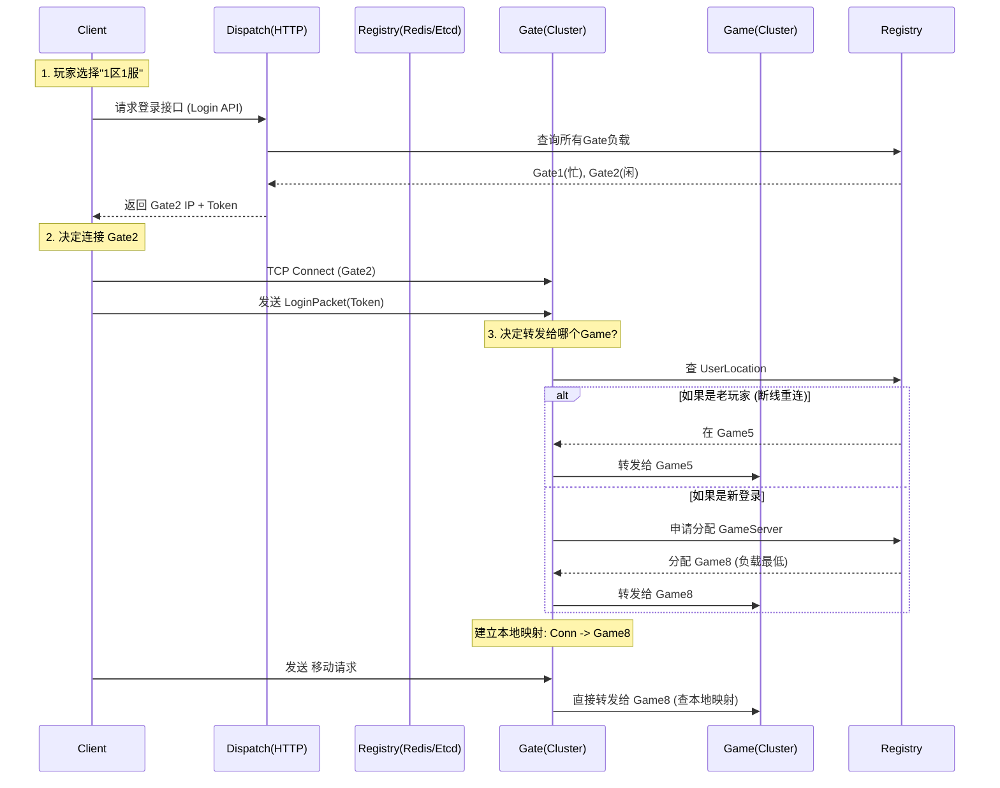

# 网络连接流程

客户端 WebSocket 请求

    ↓

http.Serve(listener, w)  ← WSConnector 实现了 http.Handler 接口

    ↓

ServeHTTP(rw, r)  ← HTTP 服务器自动调用

    ↓

upgrade.Upgrade()  ← 升级为 WebSocket 连接

    ↓

w.InChan(&conn)  ← 将连接放入 channel

    ↓

Connector.Start() 的 goroutine 监听 channel

    ↓

onConnectFunc(conn)  ← 调用注册的回调函数

    ↓

pomelo.Actor.defaultOnConnectFunc()  ← 创建 Agent

    ↓

应用层处理

# 完整的数据流：

WebSocket 连接建立
    ↓
pomelo.Actor.defaultOnConnectFunc()
    ↓
创建 Agent（包含 Session 信息）
    ↓
调用 SetOnNewAgent 注册的回调
    ↓
创建 ActorAgent 子 Actor
    ↓
agent.Run() 启动消息循环
    ↓
读取客户端消息 → 路由到对应的 Actor 处理

# 完整的数据流

客户端发送: {"route": "game.player.enter", "data": {...}}
    ↓
WebSocket 连接接收数据
    ↓
Agent.Run() 读取数据
    ↓
解析 Packet (packet.go)
    ↓
dataCommand() 处理数据包 (command.go:179)
    ↓
cmd.onDataRouteFunc(agent, route, msg)  ← 这里！
    ↓
onPomeloDataRoute() 你的路由逻辑 (gate/route.go)
    ↓
检查登录状态、选择目标节点
    ↓
ClusterLocalDataRoute() 跨节点转发
    ↓
目标节点的 Actor 处理消息
    ↓
game.player.enter() 方法被调用

# 玩家连接时

// 1. 客户端连接到 Gate
WebSocket 连接建立
    ↓
// 2. agentActor 创建 Agent（网络层封装）
agent := NewAgent(conn, session)  // sid = "abc123"
    ↓
// 3. 回调：创建 ActorAgent（业务层）
agentActor.SetOnNewAgent(func(newAgent *Agent) {
    childActor := &ActorAgent{}
    agentActor.Child().Create(newAgent.SID(), childActor)
    // 路径：gate-01.user.abc123
})
    ↓
// 4. Agent 开始接收消息
agent.Run()

# 玩家发送登录请求：

// 客户端发送：{"route": "gate.user.login", "data": {...}}

// 1. Agent 接收数据
agent.Run() → 读取数据包
    ↓
// 2. agentActor 解析协议
dataCommand() → 解析 Pomelo 消息
    ↓
// 3. 路由到 ActorAgent
onPomeloDataRoute() 
    → route = "gate.user.login"
    → targetPath = "gate-01.user.abc123"
    → funcName = "login"
    ↓
// 4. ActorAgent 处理登录
ActorAgent.login(session, req)
    → 验证 token
    → 绑定 UID
    → 返回响应

# 玩家断开连接：

// 1. 连接断开
agent.Close()
    ↓
// 2. 触发关闭回调
newAgent.AddOnClose(childActor.onSessionClose)
    ↓
// 3. ActorAgent 清理资源
ActorAgent.onSessionClose()
    → 通知 Game 节点
    → p.Exit()  // 销毁自己
    ↓
// 4. Agent 被清理
pomelo.UnbindSID(sid)

这是一个非常典型的**分布式游戏网关设计**问题。

在“1区1服”这样一个逻辑概念下，物理上其实对应着一个**集群（Cluster）**。为了保证高可用和高性能，Gate（网关）和 Game（逻辑服）都会部署多台。

这里涉及两个核心的路由决策：
1.  **Client -> Gate**：玩家怎么知道连哪个网关 IP？
2.  **Gate -> Game**：网关收到包后，怎么知道转给哪个逻辑服？

我们分步来解决：

---

### 第一阶段：怎么决定玩家连接那个 Gate 节点？

客户端不能写死 Gate 的 IP，因为 Gate 会扩容、会挂掉。
通常的做法是引入一个 **HTTP 调度服务（Dispatch Service / Login Server）**。

#### 流程如下：
1.  **登录请求**：
    玩家点击“开始游戏”，客户端先发一个 HTTP 请求给 `LoginWeb` 服务器（比如 `POST /api/login`）。
2.  **调度策略（负载均衡）**：
    `LoginWeb` 查询后台的**服务注册中心**（如 Consul, Etcd, Nacos 或 Redis），查看当前“1区1服”下所有 Gate 节点的健康状况和负载情况（在线连接数）。
    *   *Gate-1: 5000人 (拥挤)*
    *   *Gate-2: 1000人 (空闲)*
    *   *Gate-3: 宕机*
3.  **下发地址**：
    `LoginWeb` 选择最空闲的 **Gate-2**，并生成一个一次性 **Token**。
    返回给客户端：`{ "ip": "192.168.1.102", "port": 8080, "token": "abc..." }`
4.  **建立连接**：
    客户端拿着 IP 和 Port，通过 TCP/WebSocket 正式连接 Gate-2。

**总结**：决定连哪个 Gate，是由**HTTP 调度接口**根据**最少连接数（Least Connections）**策略计算出来的。

---

### 第二阶段：Gate 怎么决定转发给哪个 Game 节点？

这一步比较复杂，取决于你的 Game 节点是**有状态**还是**无状态**的。

#### 情况 A：Game 节点是无状态的（纯逻辑计算，不存数据）
*假设你的 Game 节点只负责处理协议，数据都在 Redis/DB 里。*
*   **策略**：**随机 (Random)** 或 **轮询 (Round Robin)**。
*   **实现**：Gate 随便挑一个 Game 节点发过去就行。
*   **注意**：在 SLG 中，这通常**不可能**。因为 SLG 需要内存计算战斗和行军，必须是有状态的。

#### 情况 B：Game 节点是有状态的（SLG 主流做法）
*假设 Game-Node-1 负责地图左半边，Game-Node-2 负责右半边；或者 Game-Node-1 负责处理 UserA 的所有逻辑。*

这就不能随便转了，必须实现**“会话粘滞”（Session Sticky）**。必须保证 UserA 的请求每次都发给同一台 GameServer，除非那台挂了。

**核心流程（结合 PlayerLocation）：**

1.  **握手与分配（Handshake & Allocation）**
    *   当玩家刚连上 Gate 发送第一个包（LoginPacket）时。
    *   Gate 发现这个 socket 还没有绑定 GameNode。
    *   Gate 解析出 UserID，去 **Redis (PlayerLocation)** 查询：
        *   **如果查到了**：说明玩家已经在 `Game-Node-05` 上有数据了（可能是断线重连）。**Gate 绑定：UserA -> Game-Node-05**。
        *   **如果没查到**：说明是新登录。Gate 请求 **“调度器 (Director)”**（或者自己执行调度逻辑）：
            *   调度算法：找一个负载最低的 GameNode（例如 `Game-Node-08`）。
            *   写入 Redis：`UserA -> Game-Node-08`。
            *   **Gate 绑定：UserA -> Game-Node-08**。

2.  **后续转发（Forwarding）**
    *   Gate 内部维护一张映射表（Map）：
        `ConnectionID_101` <--> `Game_Node_08`
    *   之后只要是这个连接发来的包，Gate **闭着眼**直接扔给 `Game_Node_08`。

---

### 综合架构图解

让我们把你所有的疑问串起来：

### 关键点总结

1.  **Gate 的选择**：
    *   **时机**：建立 TCP 连接之前。
    *   **决策者**：**HTTP Login Server**。
    *   **依据**：Gate 的实时在线连接数（负载均衡）。

2.  **Game 的选择**：
    *   **时机**：建立 TCP 连接后的第一个业务包。
    *   **决策者**：**Registry / Allocator**（根据 Redis 里的记录）。
    *   **依据**：
        *   **有记录**：必须回原服务器（保持状态）。
        *   **无记录**：按负载均衡策略（最小连接数、最小内存占用）分配一台新的，并记录下来。

3.  **为什么 Game 也要负载均衡？**
    *   虽然功能一样，但 **CPU/内存** 是有限的。
    *   如果不均衡，可能出现 Game1 跑了 10000 个玩家卡死，而 Game2 只有 10 个玩家在空转。
    *   通过“新登录分配”时的算法，尽量让每台 Game Server 的人数保持平均。